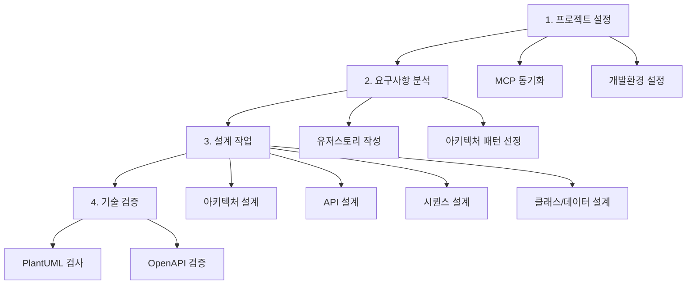

# 여행 일정 생성 서비스 설계 가이드

> 마이크로서비스 아키텍처 기반 여행 상세 일정 생성 서비스의 체계적인 설계 가이드

## 🎯 프로젝트 개요

**목표**: AI 기반 여행 상세 일정 생성 서비스  
**아키텍처**: 마이크로서비스 (프로파일, 일정, 장소 서비스)  
**기술 스택**: Spring Boot, Redis Cache, MCP (외부 API), Job Queue  

## 🚀 핵심 워크플로우

## 📚 완전한 가이드

**👉 전체 설계 가이드는 [guides/README.md](guides/README.md)를 참조하세요**

### 🚀 실행 프롬프트
- **유저스토리 실행**: [guides/prompt/userstory-prompt.md](guides/prompt/userstory-prompt.md)
- **설계 실행 모음**: [guides/prompt/design-prompt.md](guides/prompt/design-prompt.md)
  - ⚡ 클래스 설계는 3단계 병렬 처리 필수

### 📋 요구사항 분석
- **유저스토리 작성**: [guides/requirements/userstory.md](guides/requirements/userstory.md)
- **아키텍처 패턴 선정**: [guides/requirements/architecture-patterns.md](guides/requirements/architecture-patterns.md)

### 🏗️ 설계 작업  
- **아키텍처 설계**: [guides/design/architecture.md](guides/design/architecture.md)
- **API 설계**: [guides/design/api-design.md](guides/design/api-design.md)
- **시퀀스 설계**: [guides/design/sequence-design.md](guides/design/sequence-design.md)
- **클래스/데이터 설계**: [guides/design/class-data-design.md](guides/design/class-data-design.md)

### 🛠️ 기술 도구
- **PlantUML 검사**: [guides/tools/plantuml-guide.md](guides/tools/plantuml-guide.md)
- **OpenAPI to CSV**: [guides/tools/openapi-tools.md](guides/tools/openapi-tools.md)

## ⚡ 핵심 원칙

### 🔄 병렬 처리 전략
- **서브 에이전트 활용**: Task 도구로 서비스별 동시 작업
- **3단계 하이브리드 접근**: 
  1. 공통 컴포넌트 (순차)
  2. 서비스별 설계 (병렬) 
  3. 통합 검증 (순차)
- **의존성 기반 그룹화**: 의존 관계에 따른 순차/병렬 처리
- **통합 검증**: 병렬 작업 완료 후 전체 검증

### 🏗️ 마이크로서비스 설계
- **서비스 독립성**: 캐시를 통한 직접 의존성 최소화  
- **선택적 비동기**: 장시간 작업(AI 일정 생성)만 비동기
- **캐시 우선**: Redis를 통한 성능 최적화

### 📝 표준화
- **PlantUML**: 모든 다이어그램 표준 (`!theme mono`)
- **OpenAPI 3.0**: API 명세 표준
- **자동 검증**: PlantUML, OpenAPI 문법 검사 필수

## 🎯 빠른 시작

### ⚡ 실행 모드 (프롬프트 활용)
1. **📝 유저스토리**: [guides/prompt/userstory-prompt.md](guides/prompt/userstory-prompt.md) 실행
2. **🎨 설계 작업**: [guides/prompt/design-prompt.md](guides/prompt/design-prompt.md)의 각 섹션 순차 실행

### 📚 학습 모드 (가이드 활용)
1. **📋 전체 가이드 확인**: [guides/README.md](guides/README.md)
2. **📝 유저스토리 이해**: 요구사항 정의 방법
3. **🏗️ 아키텍처 이해**: 패턴 선정 및 설계 방법
4. **🔌 API 이해**: 인터페이스 설계 방법
5. **🔄 시퀀스 이해**: 플로우 설계 방법
6. **📊 상세 설계 이해**: 클래스/데이터 설계 방법

---

💡 **Tip**: 상세한 워크플로우와 상황별 가이드는 [guides/README.md](guides/README.md)에서 확인하세요!