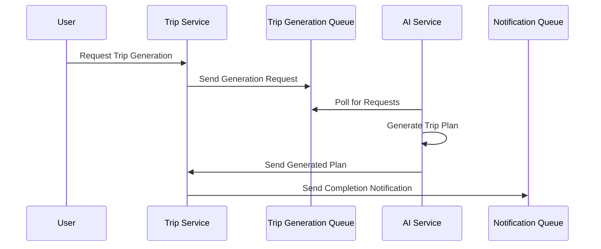

# Trip Service Message Queue 설치 계획서 (개발환경)

## 개요
- **서비스명**: Trip Service
- **환경**: Development
- **Message Queue**: Azure Service Bus Basic Tier
- **목적**: 여행 일정 관련 비동기 메시징 처리

## Azure Service Bus 설정

### 1. Service Bus Namespace 생성
```bash
# Resource Group 확인 (기존 그룹 사용)
az group show --name rg-tripgen-dev

# Service Bus Namespace 생성 (Basic Tier)
az servicebus namespace create \
    --resource-group rg-tripgen-dev \
    --name sb-tripgen-trip-dev \
    --location koreacentral \
    --sku Basic
```

### 2. Queue 설정

#### 2.1 Trip Events Queue
```bash
# 여행 일정 이벤트 처리용 큐 생성
az servicebus queue create \
    --resource-group rg-tripgen-dev \
    --namespace-name sb-tripgen-trip-dev \
    --name trip-events \
    --max-size 5120 \
    --lock-duration PT30S \
    --default-message-time-to-live P14D \
    --enable-partitioning false \
    --enable-duplicate-detection false
```

#### 2.2 Trip Generation Queue  
```bash
# AI 일정 생성 요청용 큐 생성
az servicebus queue create \
    --resource-group rg-tripgen-dev \
    --namespace-name sb-tripgen-trip-dev \
    --name trip-generation \
    --max-size 5120 \
    --lock-duration PT300S \
    --default-message-time-to-live P14D \
    --enable-partitioning false \
    --enable-duplicate-detection true \
    --duplicate-detection-history-time-window PT10M
```

#### 2.3 Trip Notifications Queue
```bash
# 여행 일정 알림용 큐 생성
az servicebus queue create \
    --resource-group rg-tripgen-dev \
    --namespace-name sb-tripgen-trip-dev \
    --name trip-notifications \
    --max-size 5120 \
    --lock-duration PT30S \
    --default-message-time-to-live P14D \
    --enable-partitioning false \
    --enable-duplicate-detection false
```

### 3. 접근 정책 설정

#### 3.1 Managed Identity 생성
```bash
# Trip Service용 Managed Identity 생성
az identity create \
    --resource-group rg-tripgen-dev \
    --name mi-trip-service-dev
```

#### 3.2 Service Bus 권한 할당
```bash
# Service Bus Data Owner 권한 할당
az role assignment create \
    --assignee $(az identity show --resource-group rg-tripgen-dev --name mi-trip-service-dev --query principalId -o tsv) \
    --role "Azure Service Bus Data Owner" \
    --scope /subscriptions/$(az account show --query id -o tsv)/resourceGroups/rg-tripgen-dev/providers/Microsoft.ServiceBus/namespaces/sb-tripgen-trip-dev
```

## 연결 설정

### 4. Connection String 구성
```json
{
  "ServiceBus": {
    "ConnectionString": "Endpoint=sb://sb-tripgen-trip-dev.servicebus.windows.net/;SharedAccessKeyName=RootManageSharedAccessKey;SharedAccessKey=<ACCESS_KEY>",
    "QueueNames": {
      "TripEvents": "trip-events",
      "TripGeneration": "trip-generation", 
      "TripNotifications": "trip-notifications"
    }
  }
}
```

### 5. Managed Identity 연결 (권장)
```json
{
  "ServiceBus": {
    "FullyQualifiedNamespace": "sb-tripgen-trip-dev.servicebus.windows.net",
    "ManagedIdentity": {
      "ClientId": "<MANAGED_IDENTITY_CLIENT_ID>"
    },
    "QueueNames": {
      "TripEvents": "trip-events",
      "TripGeneration": "trip-generation",
      "TripNotifications": "trip-notifications"
    }
  }
}
```

## Message 핸들링 설정

### 6. Queue 구성 세부사항
- **최대 큐 크기**: 5GB
- **메시지 Lock Duration**: 
  - 일반 큐: 30초
  - 생성 큐: 300초 (5분) - AI 처리 시간 고려
- **메시지 TTL**: 14일
- **Dead Letter Queue**: 자동 생성됨
- **중복 감지**: Trip Generation Queue만 활성화 (10분 윈도우)

### 7. 메시지 유형별 설정

#### Trip Events 메시지
```json
{
  "MessageType": "TripEvent",
  "Properties": {
    "EventType": "TripCreated|TripUpdated|TripDeleted|TripShared",
    "TripId": "string",
    "UserId": "string",
    "Timestamp": "datetime",
    "Source": "trip-service"
  }
}
```

#### Trip Generation 메시지
```json
{
  "MessageType": "TripGenerationRequest",
  "Properties": {
    "RequestId": "string",
    "UserId": "string",
    "Destination": "string",
    "StartDate": "date",
    "EndDate": "date",
    "Budget": "decimal",
    "Preferences": "object",
    "Priority": "High|Medium|Low"
  }
}
```

#### Trip Notifications 메시지
```json
{
  "MessageType": "TripNotification",
  "Properties": {
    "NotificationType": "TripReady|TripUpdated|TripShared",
    "TripId": "string",
    "UserId": "string",
    "Message": "string",
    "Priority": "High|Medium|Low"
  }
}
```

## 초기화 명령어

### 8. 검증 스크립트
```bash
#!/bin/bash
# Message Queue 연결 테스트
echo "Testing Trip Service Bus connection..."

# Queue 상태 확인
echo "Checking trip-events queue..."
az servicebus queue show \
    --resource-group rg-tripgen-dev \
    --namespace-name sb-tripgen-trip-dev \
    --name trip-events \
    --query '{Name:name, Status:status, MessageCount:messageCount}'

echo "Checking trip-generation queue..."
az servicebus queue show \
    --resource-group rg-tripgen-dev \
    --namespace-name sb-tripgen-trip-dev \
    --name trip-generation \
    --query '{Name:name, Status:status, MessageCount:messageCount}'

echo "Checking trip-notifications queue..."
az servicebus queue show \
    --resource-group rg-tripgen-dev \
    --namespace-name sb-tripgen-trip-dev \
    --name trip-notifications \
    --query '{Name:name, Status:status, MessageCount:messageCount}'

echo "Trip Service Message Queue setup completed!"
```

## 모니터링 설정

### 9. Application Insights 연동
```bash
# Application Insights 생성
az monitor app-insights component create \
    --app ai-trip-service-dev \
    --location koreacentral \
    --resource-group rg-tripgen-dev \
    --kind web
```

### 10. 알림 규칙 설정
```bash
# Dead Letter Queue 메시지 알림
az monitor metrics alert create \
    --name "Trip Service Dead Letter Queue Alert" \
    --resource-group rg-tripgen-dev \
    --scopes /subscriptions/$(az account show --query id -o tsv)/resourceGroups/rg-tripgen-dev/providers/Microsoft.ServiceBus/namespaces/sb-tripgen-trip-dev \
    --condition "avg DeadletteredMessages > 0" \
    --description "Alert when dead letter queue has messages"

# Trip Generation Queue 처리 시간 알림
az monitor metrics alert create \
    --name "Trip Generation Queue Processing Time Alert" \
    --resource-group rg-tripgen-dev \
    --scopes /subscriptions/$(az account show --query id -o tsv)/resourceGroups/rg-tripgen-dev/providers/Microsoft.ServiceBus/namespaces/sb-tripgen-trip-dev/queues/trip-generation \
    --condition "avg ActiveMessages > 10" \
    --description "Alert when trip generation queue has many pending messages"
```

## AI 서비스 연동

### 11. AI Service와의 메시지 흐름


### 12. 장시간 처리 고려사항
- Lock Duration: 5분 (AI 처리 시간 고려)
- Retry 정책: 최대 3회 재시도
- Circuit Breaker 패턴 적용
- Progress Tracking 메시지 전송

## 보안 고려사항

### 13. 네트워크 보안
- Private Endpoint 사용 (프로덕션 환경 권장)
- IP 필터링 규칙 적용
- VNet 통합 고려

### 14. 데이터 보안
- 민감한 여행 정보 암호화
- PII 데이터 마스킹
- 메시지 내용 로깅 제한

## 성능 최적화

### 15. 배치 처리 설정
```json
{
  "BatchProcessing": {
    "MaxBatchSize": 10,
    "BatchTimeout": "00:00:30",
    "PrefetchCount": 20
  }
}
```

### 16. 큐별 최적화 전략
- **Trip Events**: 빠른 처리를 위한 짧은 Lock Duration
- **Trip Generation**: 장시간 처리를 위한 긴 Lock Duration
- **Trip Notifications**: 실시간 알림을 위한 즉시 처리

## 비용 최적화

### 17. Basic Tier 특징
- 최대 큐 크기: 5GB
- 동시 연결 수: 100개
- 월 100만 개 작업 포함
- 추가 작업당 $0.05

### 18. 개발환경 권장사항
- 테스트 완료 후 큐 정리
- 불필요한 메시지 TTL 설정
- 모니터링을 통한 사용량 추적

## 트러블슈팅

### 19. 일반적인 문제점
1. **AI 서비스 처리 지연**: Lock Duration 증가 및 재시도 정책 조정
2. **중복 요청 처리**: Duplicate Detection 활용
3. **Dead Letter Queue 증가**: 메시지 형식 및 처리 로직 점검

### 20. 로그 확인
```bash
# Service Bus 로그 확인
az monitor activity-log list \
    --resource-group rg-tripgen-dev \
    --caller Microsoft.ServiceBus \
    --max-events 50

# 특정 큐의 메트릭 확인
az monitor metrics list \
    --resource /subscriptions/$(az account show --query id -o tsv)/resourceGroups/rg-tripgen-dev/providers/Microsoft.ServiceBus/namespaces/sb-tripgen-trip-dev/queues/trip-generation \
    --metric "ActiveMessages,DeadletteredMessages" \
    --interval PT1M
```