# User 서비스 클래스 다이어그램 (Mermaid)

```mermaid
classDiagram
    %% Domain Layer - Entities
    class User {
        -String userId
        -String username
        -String email
        -String password
        -String name
        -String phoneNumber
        -String profileImage
        -UserStatus status
        -LocalDateTime createdAt
        -LocalDateTime updatedAt
        -LocalDateTime lastLoginAt
        -int loginFailCount
        +changePassword(String newPassword)
        +updateProfile(String name, String phoneNumber)
        +updateProfileImage(String imageUrl)
        +recordLoginSuccess()
        +recordLoginFailure()
        +lock()
        +unlock()
        +isLocked() boolean
    }

    class UserSession {
        -String sessionId
        -String userId
        -String accessToken
        -String refreshToken
        -LocalDateTime createdAt
        -LocalDateTime expiresAt
        -String ipAddress
        -String userAgent
        +isExpired() boolean
        +refresh(String newAccessToken, String newRefreshToken)
        +terminate()
    }

    class UserStatus {
        <<enumeration>>
        ACTIVE
        INACTIVE
        LOCKED
        DELETED
    }

    %% Presentation Layer - DTOs
    class RegisterRequest {
        -String username
        -String email
        -String password
        -String passwordConfirm
        -String name
        -String phoneNumber
        +validate()
    }

    class LoginRequest {
        -String username
        -String password
        +validate()
    }

    class ProfileRequest {
        -String name
        -String phoneNumber
        +validate()
    }

    class PasswordChangeRequest {
        -String currentPassword
        -String newPassword
        -String newPasswordConfirm
        +validate()
    }

    class RegisterResponse {
        -String userId
        -String username
        -String email
        -String message
    }

    class LoginResponse {
        -String accessToken
        -String refreshToken
        -UserProfile profile
    }

    class UserProfile {
        -String userId
        -String username
        -String email
        -String name
        -String phoneNumber
        -String profileImage
        -UserStatus status
        -LocalDateTime createdAt
    }

    class UserCheckResponse {
        -boolean available
        -String message
    }

    %% Presentation Layer - Controller
    class UserController {
        -UserService userService
        -AuthService authService
        -ValidationService validationService
        -ImageService imageService
        +register(RegisterRequest) BaseResponse~RegisterResponse~
        +login(LoginRequest) BaseResponse~LoginResponse~
        +logout(String token) BaseResponse~Void~
        +getProfile(String token) BaseResponse~UserProfile~
        +updateProfile(String token, ProfileRequest) BaseResponse~UserProfile~
        +uploadProfileImage(String token, MultipartFile) BaseResponse~String~
        +changePassword(String token, PasswordChangeRequest) BaseResponse~Void~
        +checkUsername(String username) BaseResponse~UserCheckResponse~
        +checkEmail(String email) BaseResponse~UserCheckResponse~
        +deleteAccount(String token) BaseResponse~Void~
    }

    %% Business Layer - Services
    class UserService {
        <<interface>>
        +createUser(RegisterRequest) User
        +getUserById(String userId) User
        +getUserByUsername(String username) User
        +updateUser(User user) User
        +deleteUser(String userId)
        +checkUsernameAvailability(String username) boolean
        +checkEmailAvailability(String email) boolean
    }

    class UserServiceImpl {
        -UserRepository userRepository
        -PasswordEncoder passwordEncoder
        -CacheService cacheService
        +createUser(RegisterRequest) User
        +getUserById(String userId) User
        +getUserByUsername(String username) User
        +updateUser(User user) User
        +deleteUser(String userId)
        +checkUsernameAvailability(String username) boolean
        +checkEmailAvailability(String email) boolean
    }

    class AuthService {
        <<interface>>
        +login(LoginRequest) LoginResponse
        +logout(String token)
        +validateToken(String token) boolean
        +refreshToken(String refreshToken) TokenResponse
    }

    class AuthServiceImpl {
        -UserService userService
        -UserSessionRepository sessionRepository
        -JwtTokenService tokenService
        -PasswordEncoder passwordEncoder
        +login(LoginRequest) LoginResponse
        +logout(String token)
        +validateToken(String token) boolean
        +refreshToken(String refreshToken) TokenResponse
    }

    class ValidationService {
        <<interface>>
        +validateEmail(String email)
        +validatePassword(String password)
        +validatePhoneNumber(String phoneNumber)
        +validateUsername(String username)
    }

    class ValidationServiceImpl {
        +validateEmail(String email)
        +validatePassword(String password)  
        +validatePhoneNumber(String phoneNumber)
        +validateUsername(String username)
    }

    class ImageService {
        <<interface>>
        +uploadImage(MultipartFile file) String
        +deleteImage(String imageUrl)
        +validateImage(MultipartFile file)
    }

    class ImageServiceImpl {
        -String uploadPath
        -long maxFileSize
        +uploadImage(MultipartFile file) String
        +deleteImage(String imageUrl)
        +validateImage(MultipartFile file)
    }

    class JwtTokenService {
        <<interface>>
        +generateAccessToken(String userId) String
        +generateRefreshToken(String userId) String
        +validateToken(String token) boolean
        +extractUserId(String token) String
    }

    class JwtTokenServiceImpl {
        -String jwtSecret
        -long accessTokenExpiration
        -long refreshTokenExpiration
        +generateAccessToken(String userId) String
        +generateRefreshToken(String userId) String
        +validateToken(String token) boolean
        +extractUserId(String token) String
    }

    %% Persistence Layer - Repository
    class UserRepository {
        <<interface>>
        +save(User user) User
        +findById(String userId) Optional~User~
        +findByUsername(String username) Optional~User~
        +findByEmail(String email) Optional~User~
        +existsByUsername(String username) boolean
        +existsByEmail(String email) boolean
        +delete(User user)
    }

    class UserRepositoryImpl {
        -JpaUserRepository jpaRepository
        -RedisTemplate redisTemplate
        +save(User user) User
        +findById(String userId) Optional~User~
        +findByUsername(String username) Optional~User~
        +findByEmail(String email) Optional~User~
        +existsByUsername(String username) boolean
        +existsByEmail(String email) boolean
        +delete(User user)
    }

    class UserSessionRepository {
        <<interface>>
        +save(UserSession session) UserSession
        +findBySessionId(String sessionId) Optional~UserSession~
        +findByUserId(String userId) List~UserSession~
        +findByAccessToken(String token) Optional~UserSession~
        +delete(UserSession session)
        +deleteByUserId(String userId)
    }

    class UserSessionRepositoryImpl {
        -JpaUserSessionRepository jpaRepository
        -RedisTemplate redisTemplate
        +save(UserSession session) UserSession
        +findBySessionId(String sessionId) Optional~UserSession~
        +findByUserId(String userId) List~UserSession~
        +findByAccessToken(String token) Optional~UserSession~
        +delete(UserSession session)
        +deleteByUserId(String userId)
    }

    %% Persistence Layer - Entities
    class UserEntity {
        -Long id
        -String userId
        -String username
        -String email
        -String password
        -String name
        -String phoneNumber
        -String profileImage
        -String status
        -LocalDateTime createdAt
        -LocalDateTime updatedAt
        -LocalDateTime lastLoginAt
        -int loginFailCount
    }

    class UserSessionEntity {
        -Long id
        -String sessionId
        -String userId
        -String accessToken
        -String refreshToken
        -LocalDateTime createdAt
        -LocalDateTime expiresAt
        -String ipAddress
        -String userAgent
    }

    %% Relationships
    User --> UserStatus
    UserSession --> User
    
    UserController --> UserService
    UserController --> AuthService
    UserController --> ValidationService
    UserController --> ImageService
    
    UserServiceImpl ..|> UserService
    AuthServiceImpl ..|> AuthService
    ValidationServiceImpl ..|> ValidationService
    ImageServiceImpl ..|> ImageService
    JwtTokenServiceImpl ..|> JwtTokenService
    
    UserServiceImpl --> UserRepository
    AuthServiceImpl --> UserService
    AuthServiceImpl --> UserSessionRepository
    AuthServiceImpl --> JwtTokenService
    
    UserRepositoryImpl ..|> UserRepository
    UserSessionRepositoryImpl ..|> UserSessionRepository
    
    UserRepositoryImpl --> UserEntity
    UserSessionRepositoryImpl --> UserSessionEntity
    
    LoginResponse --> UserProfile
```

## 다이어그램 설명

### 계층별 구성

1. **Domain Layer (도메인 계층)**
   - `User`, `UserSession`: 핵심 도메인 엔티티
   - `UserStatus`: 사용자 상태 열거형

2. **Presentation Layer (프레젠테이션 계층)**
   - `UserController`: REST API 엔드포인트
   - Request DTOs: 클라이언트 요청 데이터
   - Response DTOs: 서버 응답 데이터

3. **Business Layer (비즈니스 계층)**
   - Service Interfaces: 비즈니스 로직 인터페이스
   - Service Implementations: 실제 비즈니스 로직 구현

4. **Persistence Layer (영속성 계층)**
   - Repository Interfaces: 데이터 접근 인터페이스
   - Repository Implementations: JPA/Redis 기반 구현
   - JPA Entities: 데이터베이스 매핑 엔티티

### 주요 특징

- **Layered Architecture**: 각 계층이 명확히 분리되어 있음
- **의존성 방향**: 상위 계층이 하위 계층에만 의존
- **인터페이스 기반 설계**: 구현체 교체 용이
- **캐싱 전략**: Redis를 통한 성능 최적화