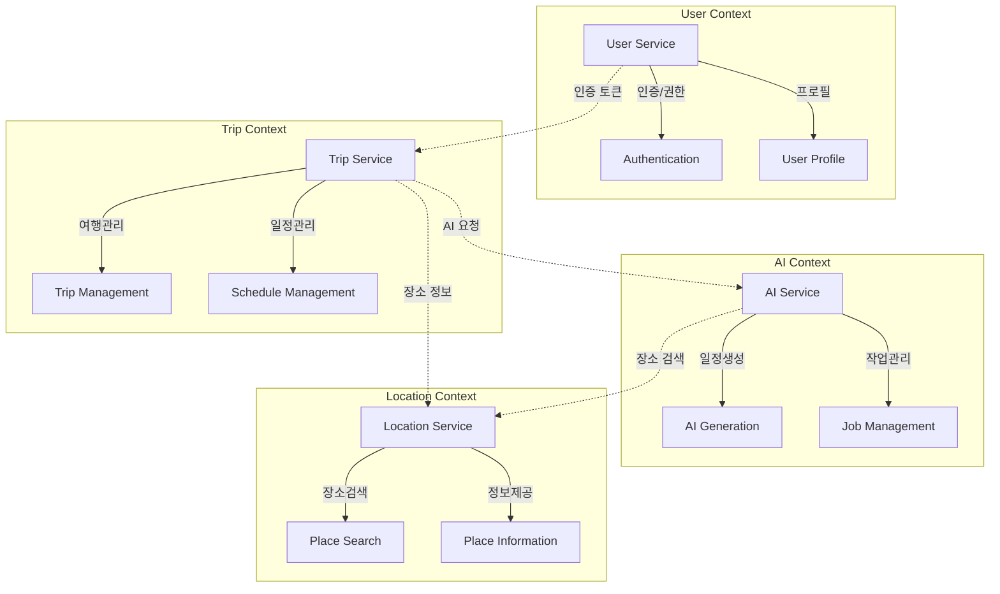
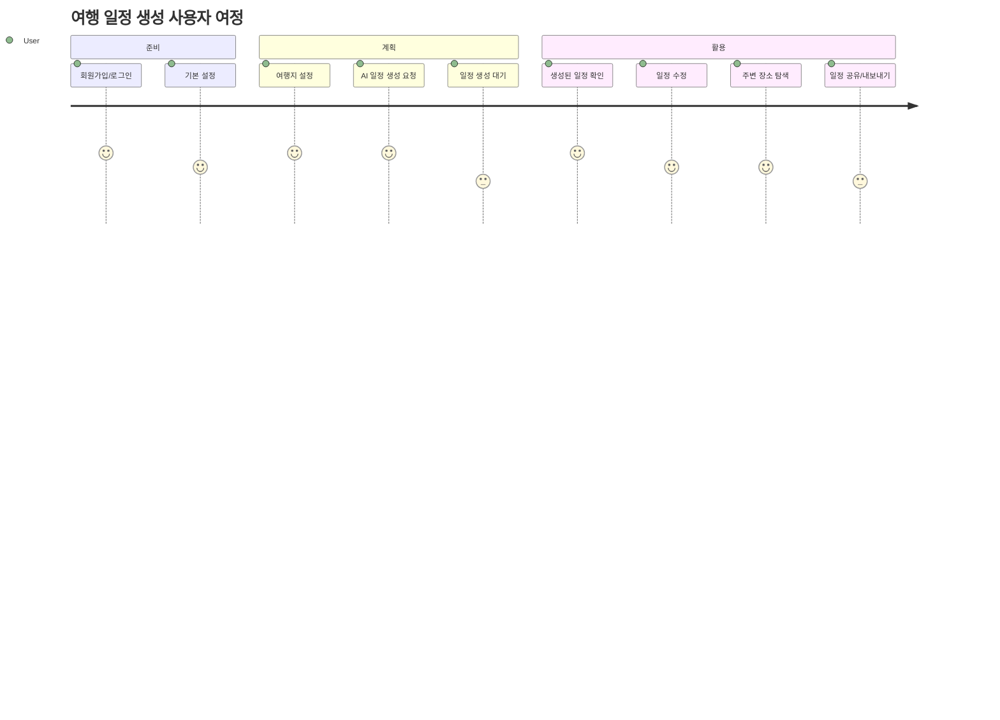

# HighLevel아키텍처정의서

## 1. 개요 (Executive Summary)

### 1.1 프로젝트 개요
- **비즈니스 목적**: AI 기반 개인 맞춤형 여행 일정 자동 생성 서비스 제공
- **핵심 기능**: 
  - 사용자 기본 설정 및 선호도 관리
  - AI 기반 여행 일정 자동 생성 (5초 이내)
  - 실시간 주변 장소 검색 및 추천
  - 여행 일정 조회/수정/공유/내보내기
- **대상 사용자**: 개인 여행객, 가족/친구 그룹 여행자
- **예상 사용자 규모**: MVP 단계 1,000명 → 확장 단계 10,000명 → 고도화 단계 100,000명

### 1.2 아키텍처 범위 및 경계
- **시스템 범위**: User, Trip, AI, Location 4개 마이크로서비스
- **포함되는 시스템**: 
  - 사용자 관리 시스템 (회원가입, 인증, 프로필)
  - 여행 관리 시스템 (기본설정, 여행지 설정, 일정 관리)
  - AI 일정 생성 시스템 (AI 모델 연동, 비동기 처리)
  - 장소 정보 시스템 (주변장소 검색, 상세정보 제공)
- **제외되는 시스템**: 결제, 예약, 리뷰 시스템
- **외부 시스템 연동**: 
  - AI 모델 API (GPT-4, Claude 등)
  - 날씨 정보 API (OpenWeatherMap)
  - 지도/장소 정보 API (Google Maps, 네이버 지도)

### 1.3 문서 구성
이 문서는 4+1 뷰 모델을 기반으로 구성되며, 논리적/물리적/프로세스/개발 관점에서 아키텍처를 정의합니다.

---

## 2. 아키텍처 요구사항

### 2.1 기능 요구사항 요약
| 영역 | 주요 기능 | 우선순위 |
|------|-----------|----------|
| 사용자 관리 | 회원가입, 로그인, 프로필 관리 | High |
| 여행 계획 | 기본설정, 여행지 설정, 일정 조회/수정 | High |
| AI 일정 생성 | AI 기반 자동 일정 생성, 개인 맞춤화 | High |
| 장소 정보 | 주변장소 검색, 상세정보 제공 | Medium |
| 일정 관리 | 일정 공유, 내보내기 | Medium |

### 2.2 비기능 요구사항 (NFRs)

#### 2.2.1 성능 요구사항
- **응답시간**: 
  - 일반 API: 200ms 이내
  - AI 일정 생성: 5초 이내 (핵심 요구사항)
  - 장소 검색: 500ms 이내
- **처리량**: 
  - MVP: 10 TPS
  - 확장: 100 TPS
  - 고도화: 1,000 TPS
- **동시사용자**: 
  - MVP: 50명
  - 확장: 500명
  - 고도화: 5,000명
- **데이터 처리량**: AI 일정 생성 시 1MB/request

#### 2.2.2 확장성 요구사항
- **수평 확장**: 서비스별 독립적 확장 가능
- **수직 확장**: AI 서비스 리소스 집중 확장
- **글로벌 확장**: 다국어 지원 준비 (영어/한국어)

#### 2.2.3 가용성 요구사항
- **목표 가용성**: 99.9% (월 43.8분 다운타임 허용)
- **다운타임 허용**: 계획된 유지보수 2시간/월
- **재해복구 목표**: RTO 30분, RPO 15분

#### 2.2.4 보안 요구사항
- **인증/인가**: JWT 기반 토큰 인증, RBAC 권한 관리
- **데이터 암호화**: HTTPS (TLS 1.3), 민감정보 AES-256 암호화
- **네트워크 보안**: API Gateway 기반 보안 정책, 레이트 리미팅
- **컴플라이언스**: 개인정보보호법, GDPR 준수

### 2.3 아키텍처 제약사항
- **기술적 제약**: AI 응답시간 5초 제한, 오픈소스 DB 활용
- **비용 제약**: MVP 단계 클라우드 비용 월 $500 이내
- **시간 제약**: MVP 개발 2개월 완료
- **조직적 제약**: 6명 Agentic Workflow 팀 구성

---

## 3. 아키텍처 설계 원칙

### 3.1 핵심 설계 원칙
1. **확장성 우선**: 수평적 확장이 가능한 마이크로서비스 구조
2. **장애 격리**: 서비스별 독립적 배포 및 Circuit Breaker 패턴
3. **느슨한 결합**: 서비스 간 캐시 기반 통신으로 직접 의존성 최소화
4. **관측 가능성**: 분산 추적, 로깅, 모니터링 체계 구축
5. **보안 바이 데자인**: 설계 단계부터 보안 고려 (Zero Trust)

### 3.2 아키텍처 품질 속성 우선순위
| 순위 | 품질 속성 | 중요도 | 전략 |
|------|-----------|--------|------|
| 1 | 성능 (AI 5초 제한) | High | Cache-Aside with Async Fallback |
| 2 | 확장성 | High | 마이크로서비스, 컨테이너 오케스트레이션 |
| 3 | 가용성 | Medium | Circuit Breaker, 헬스체크 |

---

## 4. 논리 아키텍처 (Logical View)

### 4.1 시스템 컨텍스트 다이어그램
```
design/backend/logical/logical-architecture.md
```

### 4.2 도메인 아키텍처
#### 4.2.1 도메인 모델
| 도메인 | 책임 | 주요 엔티티 |
|--------|------|-------------|
| User | 사용자 관리, 인증 | User, UserProfile |
| Trip | 여행 계획 관리 | Trip, TripMember, Destination, Schedule |
| AI | AI 기반 일정 생성 | AIJob, AIResult |
| Location | 장소 정보 관리 | Place, PlaceDetail, Route, Weather |

#### 4.2.2 바운디드 컨텍스트


### 4.3 서비스 아키텍처
#### 4.3.1 마이크로서비스 구성
| 서비스명 | 책임 |
|----------|------|
| User Service | 사용자 등록/인증, 프로필 관리 |
| Trip Service | 여행 기본설정, 여행지 설정, 일정 관리 |
| AI Service | AI 기반 일정 생성, 비동기 작업 처리 |
| Location Service | 주변장소 검색, 장소 상세정보 제공 |

#### 4.3.2 서비스 간 통신 패턴
- **동기 통신**: REST API (사용자 인증, 장소 검색)
- **비동기 통신**: Message Queue (AI 일정 생성, 알림)
- **데이터 일관성**: Cache-Aside with Async Fallback 패턴

---

## 5. 프로세스 아키텍처 (Process View)

### 5.1 주요 비즈니스 프로세스
#### 5.1.1 핵심 사용자 여정


#### 5.1.2 시스템 간 통합 프로세스
```
design/backend/sequence/outer/여행계획생성플로우.puml
design/backend/sequence/outer/AI일정생성처리플로우.puml
design/backend/sequence/outer/주변장소검색플로우.puml
```

### 5.2 동시성 및 동기화
- **동시성 처리 전략**: 서비스별 독립적 처리, 공유 자원 없음
- **락 관리**: 데이터베이스 레벨 트랜잭션, 분산락 미사용
- **이벤트 순서 보장**: 메시지 큐 순서 보장, 멱등성 처리

---

## 6. 개발 아키텍처 (Development View)

### 6.1 개발 언어 및 프레임워크 선정
#### 6.1.1 백엔드 기술스택
| 서비스 | 언어 | 프레임워크 | 선정이유 |
|----------|------|---------------|----------|
| User Service | Java 21 | Spring Boot 3.3 | 엔터프라이즈 표준, 보안 기능 |
| Trip Service | Java 21 | Spring Boot 3.3 | 복잡한 비즈니스 로직 처리 |
| AI Service | Java 21 | Spring Boot 3.3 | 비동기 처리, 외부 API 연동 |
| Location Service | Java 21 | Spring Boot 3.3 | 지리정보 처리, 캐싱 최적화 |

#### 6.1.2 프론트엔드 기술스택
- **언어**: TypeScript 5.5
- **프레임워크**: React 18.3 + Vite 5.4
- **선정 이유**: 
  - 대시보드 형태 UI 최적화
  - 컴포넌트 재사용성 극대화
  - PWA 지원으로 모바일 경험 향상

### 6.2 서비스별 개발 아키텍처 패턴
| 서비스 | 아키텍처 패턴 | 선정 이유 |
|--------|---------------|-----------|
| User Service | Layered Architecture | 단순한 CRUD, 빠른 개발 |
| Trip Service | Clean Architecture | 복잡한 비즈니스 로직, 테스트 용이성 |
| AI Service | Layered Architecture | 외부 API 연동 중심 |
| Location Service | Layered Architecture | 캐싱 및 검색 최적화 |

### 6.3 개발 가이드라인
- **코딩 표준**: https://raw.githubusercontent.com/cna-bootcamp/clauding-guide/refs/heads/main/standards/standard_comment.md
- **테스트 전략**: https://raw.githubusercontent.com/cna-bootcamp/clauding-guide/refs/heads/main/standards/standard_testcode.md

---

## 7. 물리 아키텍처 (Physical View)

### 7.1 클라우드 아키텍처 패턴
#### 7.1.1 선정된 클라우드 패턴
- **패턴명**: API Gateway + Cache-Aside + Asynchronous Request-Reply + Circuit Breaker + Priority Queue
- **적용 이유**: 
  - AI 응답시간 5초 제한 극복
  - 서비스별 독립적 확장성
  - 장애 격리 및 복원력
- **예상 효과**: 
  - 캐시 히트율 80% 달성
  - AI 요청 응답시간 95% 감소
  - 서비스 가용성 99.9% 달성

#### 7.1.2 클라우드 제공자
- **주 클라우드**: Azure (기본 설정)
- **멀티 클라우드 전략**: 고도화 단계에서 AWS 확장 고려
- **하이브리드 구성**: 미적용 (클라우드 우선)

### 7.2 인프라스트럭처 구성
#### 7.2.1 컴퓨팅 리소스
| 구성요소 | 사양 | 스케일링 전략 |
|----------|------|---------------|
| 웹서버 | Standard B2s (2 vCPU, 4GB RAM) | HPA 2-10 인스턴스 |
| 앱서버 | Standard B4ms (4 vCPU, 16GB RAM) | 서비스별 독립 HPA |
| 데이터베이스 | Azure Database for PostgreSQL Flexible Server | 읽기 복제본 확장 |

#### 7.2.2 네트워크 구성
```
[인터넷] --> [Azure Application Gateway] --> [AKS Ingress]
            --> [Service Mesh (Istio)] --> [Pod Services]
```

#### 7.2.3 보안 구성
- **방화벽**: Azure Firewall + Network Security Groups
- **WAF**: Azure Application Gateway WAF
- **DDoS 방어**: Azure DDoS Protection Standard
- **VPN/Private Link**: Azure Private Link (데이터베이스 연결)

---

## 8. 기술 스택 아키텍처

### 8.1 API Gateway & Service Mesh
#### 8.1.1 API Gateway
- **제품**: Istio Gateway + Spring Cloud Gateway
- **주요 기능**: JWT 인증, 라우팅, 레이트 리미팅 (100 req/min/user), 모니터링
- **설정 전략**: 
  - 서비스별 라우팅 규칙
  - 사용자별 요청 제한
  - 장애 시 Circuit Breaker 동작

#### 8.1.2 Service Mesh
- **제품**: Istio 1.22
- **적용 범위**: 4개 마이크로서비스 간 통신
- **트래픽 관리**: 
  - mTLS 자동 적용
  - 트래픽 분할 (Canary 배포)
  - 장애 주입 테스트

### 8.2 데이터 아키텍처
#### 8.2.1 데이터베이스 전략
| 용도 | 데이터베이스 | 타입 | 특징 |
|------|-------------|------|------|
| 트랜잭션 | PostgreSQL 16 | RDBMS | 서비스별 독립 스키마 |
| 캐시 | Redis 7.2 | In-Memory | 클러스터 모드, 80% 히트율 목표 |
| 검색 | PostgreSQL Full-Text | Search | 장소명/주소 검색 최적화 |
| 분석 | PostgreSQL + TimescaleDB | Time Series | 사용자 행동 분석 |

#### 8.2.2 데이터 파이프라인
```
[Application] --> [PostgreSQL] --> [Change Data Capture]
                                --> [Analytics DB (TimescaleDB)]
              --> [Redis Cache] --> [Cache Invalidation]
```

### 8.3 백킹 서비스 (Backing Services)
#### 8.3.1 메시징 & 이벤트 스트리밍
- **메시지 큐**: Azure Service Bus (AI 일정 생성 요청)
- **이벤트 스트리밍**: Azure Event Hubs (사용자 행동 로그)
- **이벤트 스토어**: PostgreSQL (이벤트 소싱 패턴)

#### 8.3.2 스토리지 서비스
- **객체 스토리지**: Azure Blob Storage (사용자 프로필 이미지)
- **블록 스토리지**: Azure Managed Disks (데이터베이스 스토리지)
- **파일 스토리지**: Azure Files (공유 설정 파일)

### 8.4 관측 가능성 (Observability)
#### 8.4.1 로깅 전략
- **로그 수집**: Fluentd + Azure Log Analytics
- **로그 저장**: Azure Log Analytics Workspace
- **로그 분석**: KQL 쿼리, 자동 알람

#### 8.4.2 모니터링 & 알람
- **메트릭 수집**: Prometheus + Azure Monitor
- **시각화**: Grafana + Azure Dashboard
- **알람 정책**: 
  - 응답시간 > 200ms (일반 API)
  - AI 응답시간 > 5초 (Critical)
  - 메모리 사용률 > 80%

#### 8.4.3 분산 추적
- **추적 도구**: Jaeger + Azure Application Insights
- **샘플링 전략**: 10% 샘플링 (비용 최적화)
- **성능 분석**: 병목 구간 자동 식별

---

## 9. AI/ML 아키텍처

### 9.1 AI API 통합 전략
#### 9.1.1 AI 서비스/모델 매핑
| 목적 | 서비스 | 모델 | Input 데이터 | Output 데이터 | SLA |
|------|--------|-------|-------------|-------------|-----|
| 일정 생성 | OpenAI | GPT-4o | 여행 기본정보, 선호도 | 일정 JSON | 5초 |
| 장소 추천 | OpenAI | GPT-4o-mini | 사용자 위치, 선호도 | 추천 장소 목록 | 3초 |
| 날씨 기반 조정 | 내부 로직 | Rule-based | 날씨 정보, 일정 | 조정된 일정 | 1초 |

#### 9.1.2 AI 파이프라인
```
[사용자 요청] --> [입력 검증] --> [컨텍스트 구성] --> [AI API 호출]
                                                   --> [결과 검증] --> [후처리] --> [캐시 저장]
```

### 9.2 데이터 과학 플랫폼
- **모델 개발 환경**: 미적용 (외부 AI API 사용)
- **모델 배포 전략**: API 기반 통합, 모델 버전 관리
- **모델 모니터링**: 응답시간, 성공률, 품질 점수 추적

---

## 10. 개발 운영 (DevOps)

### 10.1 CI/CD 파이프라인
#### 10.1.1 지속적 통합 (CI)
- **도구**: GitHub Actions (팀 친화도, 무료 범위)
- **빌드 전략**: 
  - Maven 멀티모듈 빌드
  - 서비스별 독립 빌드
  - 단위/통합 테스트 자동 실행
- **테스트 자동화**: 
  - 단위 테스트 커버리지 80% 이상
  - 통합 테스트 핵심 플로우
  - 보안 스캔 (SAST/DAST)

#### 10.1.2 지속적 배포 (CD)
- **배포 도구**: ArgoCD (GitOps 패턴)
- **배포 전략**: 
  - 개발: 자동 배포
  - 프로덕션: Blue-Green 배포
- **롤백 정책**: 자동 헬스체크 실패 시 5분 내 자동 롤백

### 10.2 컨테이너 오케스트레이션
#### 10.2.1 Kubernetes 구성
- **클러스터 전략**: Azure Kubernetes Service (AKS)
- **네임스페이스 설계**: 
  - `tripgen-dev`: 개발 환경
  - `tripgen-prod`: 프로덕션 환경
- **리소스 관리**: 
  - CPU/메모리 Requests/Limits 설정
  - HPA 기반 자동 확장

#### 10.2.2 헬름 차트 관리
- **차트 구조**: 서비스별 차트 + 공통 차트
- **환경별 설정**: values-dev.yaml, values-prod.yaml
- **의존성 관리**: Chart.yaml dependency 명시

---

## 11. 보안 아키텍처

### 11.1 보안 전략
#### 11.1.1 보안 원칙
- **Zero Trust**: 모든 요청 검증, mTLS 통신
- **Defense in Depth**: 다층 보안 (Network, Application, Data)
- **Least Privilege**: 최소 권한 원칙, RBAC 적용

#### 11.1.2 위협 모델링
| 위협 | 영향도 | 대응 방안 |
|------|--------|-----------|
| 무단 접근 | High | JWT 토큰 + 레이트 리미팅 |
| 데이터 유출 | High | 암호화 + 접근 로그 |
| DDoS 공격 | Medium | Azure DDoS Protection |
| SQL 인젝션 | Medium | Prepared Statement + 입력 검증 |

### 11.2 보안 구현
#### 11.2.1 인증 & 인가
- **ID 제공자**: 자체 구현 (User Service)
- **토큰 전략**: JWT (Access 1시간, Refresh 7일)
- **권한 모델**: RBAC (USER, ADMIN 역할)

#### 11.2.2 데이터 보안
- **암호화 전략**: 
  - 전송: TLS 1.3
  - 저장: AES-256 (민감정보)
  - 비밀번호: bcrypt
- **키 관리**: Azure Key Vault
- **데이터 마스킹**: 로그에서 민감정보 제거

---

## 12. 품질 속성 구현 전략

### 12.1 성능 최적화
#### 12.1.1 캐싱 전략
| 계층 | 캐시 유형 | TTL | 무효화 전략 |
|------|-----------|-----|-------------|
| Application | Spring Cache | 5분 | 수동 무효화 |
| Database | Redis | 30분 | 데이터 변경 시 |
| CDN | Azure CDN | 24시간 | 버전 기반 |

#### 12.1.2 데이터베이스 최적화
- **인덱싱 전략**: 
  - B-tree 인덱스 (기본키, 외래키)
  - 복합 인덱스 (검색 조건)
  - Full-text 인덱스 (장소명 검색)
- **쿼리 최적화**: EXPLAIN 분석, N+1 문제 방지
- **커넥션 풀링**: HikariCP (최대 20개 연결)

### 12.2 확장성 구현
#### 12.2.1 오토스케일링
- **수평 확장**: HPA (CPU 70%, 메모리 80% 기준)
- **수직 확장**: VPA (개발 단계 미적용)
- **예측적 스케일링**: 고도화 단계 검토

#### 12.2.2 부하 분산
- **로드 밸런서**: Azure Application Gateway (L7)
- **트래픽 분산 정책**: Round Robin + Health Check
- **헬스체크**: /actuator/health (30초 간격)

### 12.3 가용성 및 복원력
#### 12.3.1 장애 복구 전략
- **Circuit Breaker**: Resilience4j (실패율 50% 기준)
- **Retry Pattern**: 지수 백오프 (최대 3회)
- **Bulkhead Pattern**: 서비스별 리소스 격리

#### 12.3.2 재해 복구
- **백업 전략**: 
  - 데이터베이스: 일일 자동 백업
  - 설정 파일: Git 기반 버전 관리
- **RTO/RPO**: RTO 30분, RPO 15분
- **DR 사이트**: 고도화 단계 다른 리전 구축

---

## 13. 아키텍처 의사결정 기록 (ADR)

### 13.1 주요 아키텍처 결정
| ID | 결정 사항 | 결정 일자 | 상태 | 결정 이유 |
|----|-----------|-----------|------|-----------|
| ADR-001 | Spring Boot 선택 | 2024-07-29 | 승인 | 팀 친화도, 엔터프라이즈 지원 |
| ADR-002 | Cache-Aside 패턴 | 2024-07-29 | 승인 | AI 5초 제한 극복 |
| ADR-003 | PostgreSQL 선택 | 2024-07-29 | 승인 | 오픈소스, JSON 지원 |
| ADR-004 | Istio Service Mesh | 2024-07-29 | 승인 | mTLS, 트래픽 관리 |

### 13.2 트레이드오프 분석
#### 13.2.1 성능 vs 확장성
- **고려사항**: AI 응답시간 vs 동시 처리량
- **선택**: 성능 우선 (캐싱 전략)
- **근거**: AI 5초 제한이 핵심 요구사항

#### 13.2.2 일관성 vs 가용성 (CAP 정리)
- **고려사항**: 여행 데이터 일관성 vs 서비스 가용성
- **선택**: AP (가용성 + 분할 내성)
- **근거**: 여행 일정은 일시적 불일치 허용 가능

---

## 14. 구현 로드맵

### 14.1 개발 단계
| 단계 | 기간 | 주요 산출물 | 마일스톤 |
|------|------|-------------|-----------|
| Phase 1 (MVP) | 2개월 | 핵심 4개 서비스, 기본 UI | AI 일정 생성 데모 |
| Phase 2 (확장) | 2개월 | 성능 최적화, 모니터링 | 1,000명 사용자 지원 |
| Phase 3 (고도화) | 2개월 | 고급 기능, 다국어 지원 | 상용 서비스 런칭 |

### 14.2 마이그레이션 전략 (레거시 시스템이 있는 경우)
- **데이터 마이그레이션**: 해당 없음 (신규 구축)
- **기능 마이그레이션**: 해당 없음
- **병행 운영**: 해당 없음

---

## 15. 위험 관리

### 15.1 아키텍처 위험
| 위험 | 영향도 | 확률 | 완화 방안 |
|------|--------|------|-----------|
| AI API 장애 | High | Medium | Circuit Breaker + 대체 모델 |
| 캐시 실패 | Medium | Low | 원본 데이터 Fallback |
| 성능 저하 | High | Medium | 모니터링 + 자동 스케일링 |
| 보안 침해 | High | Low | 다층 보안 + 접근 로그 |

### 15.2 기술 부채 관리
- **식별된 기술 부채**: 
  - 수동 테스트 (자동화 필요)
  - 모니터링 미비 (관측 가능성 구축 필요)
- **해결 우선순위**: 1. 자동화 테스트 2. 모니터링 3. 문서화
- **해결 계획**: Phase 2에서 기술 부채 해결에 30% 시간 할당

---

## 16. 부록

### 16.1 참조 아키텍처
- **업계 표준**: Microservices Pattern (Chris Richardson)
- **내부 표준**: 팀 Agentic Workflow 방법론
- **외부 참조**: Azure Well-Architected Framework

### 16.2 용어집
| 용어 | 정의 |
|------|------|
| Cache-Aside | 애플리케이션이 직접 캐시를 관리하는 패턴 |
| Circuit Breaker | 장애 전파 방지를 위한 차단기 패턴 |
| HPA | Horizontal Pod Autoscaler (수평 자동 확장) |
| mTLS | Mutual TLS (상호 인증 TLS) |

### 16.3 관련 문서
- 유저스토리: design/userstory.md
- 아키텍처패턴: design/pattern/아키텍처패턴.md
- 논리아키텍처: design/backend/logical/logical-architecture.md
- API설계서: design/backend/api/*.yaml
- 외부시퀀스설계서: design/backend/sequence/outer/*.puml
- 내부시퀀스설계서: design/backend/sequence/inner/*.puml
- 클래스설계서: design/backend/class/*.puml, design/backend/class/class.md
- 데이터설계서: design/backend/database/*.md

---

## 문서 이력
| 버전 | 일자 | 작성자 | 변경 내용 | 승인자 |
|------|------|--------|-----------|-------|
| v1.0 | 2024-07-29 | 김개발(테키) | 초기 작성 | 이여행(트래블) |