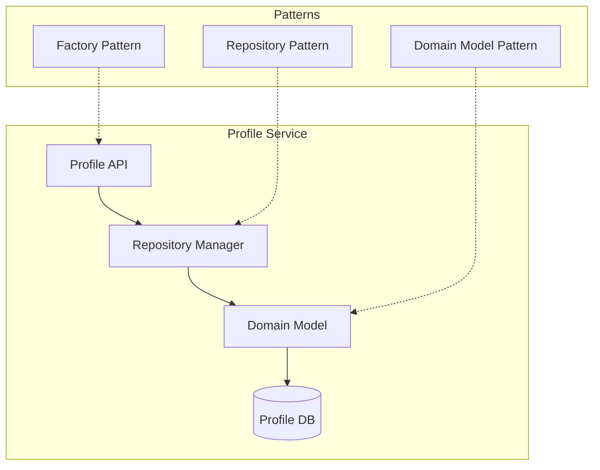
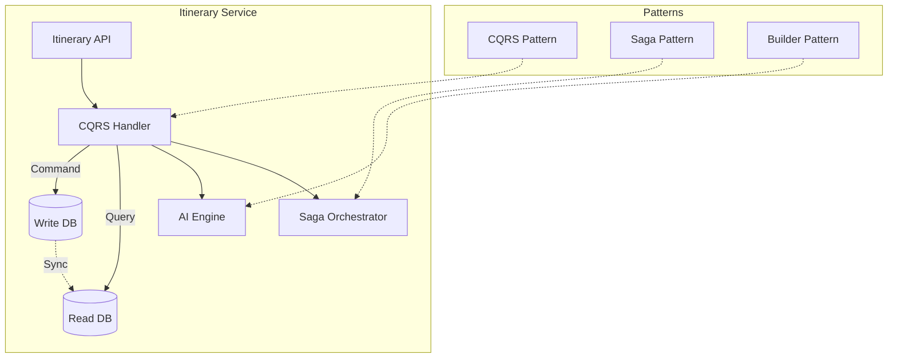
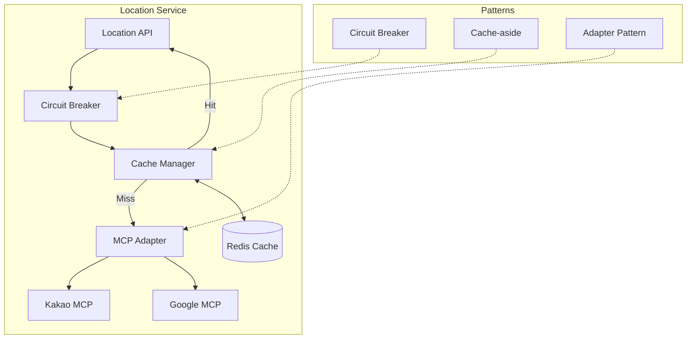
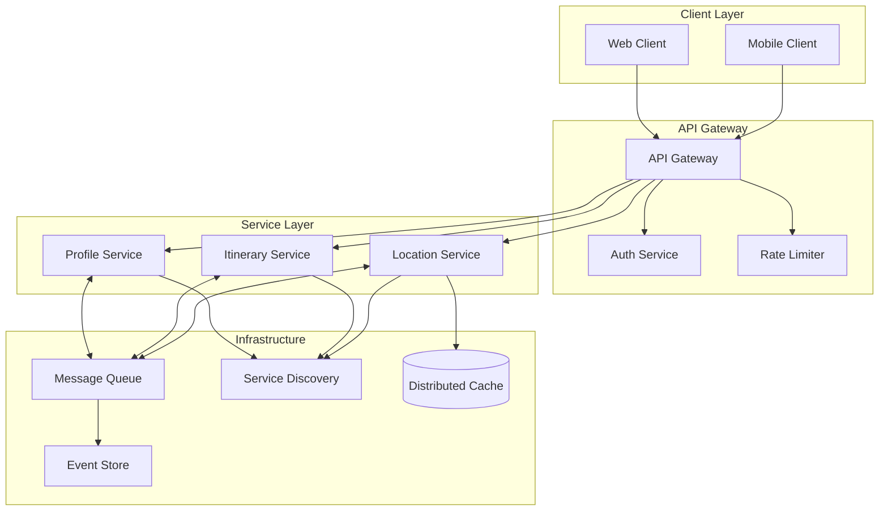

# 여행 일정 생성 서비스 - 클라우드 아키텍처 패턴 적용 방안

## 1. 체계적 요구사항 분석

### 1.1 서비스별 핵심 요구사항

#### 프로파일 서비스
- **기능적 요구사항**
  - 여행 멤버 정보 CRUD (이름, 나이, 건강상태, 선호사항)
  - 여행 기본 정보 설정 (날짜, 위치, 숙소)
  - 이동 수단 설정 및 관리
  
- **비기능적 요구사항**
  - 동시 사용자 1,000명 처리
  - 데이터 일관성 보장
  - 개인정보 보호

#### 일정 서비스
- **기능적 요구사항**
  - AI 기반 일정 자동 생성 (멤버 특성 고려)
  - 장소별 상세 정보 제공
  - 이동 경로 및 시간 계산
  - 사진/메모 첨부 기능
  
- **비기능적 요구사항**
  - AI 일정 생성 시간 < 10초
  - 일정 조회 응답시간 < 500ms
  - 성수기 10배 트래픽 처리

#### 장소 서비스
- **기능적 요구사항**
  - MCP 기반 실시간 장소 검색
  - 실시간 정보 검증 (영업시간, 평점)
  - 지역 특성 기반 추천
  - 다국어 검색 지원
  
- **비기능적 요구사항**
  - MCP API 응답시간 < 2초
  - 99.9% 가용성 보장
  - API 호출 비용 최적화

### 1.2 기술적 과제 도출

| 과제 | 설명 | 우선순위 |
|------|------|----------|
| 성능 최적화 | AI 처리 및 외부 API 호출 최적화 | 높음 |
| 확장성 확보 | 성수기 트래픽 10배 증가 대응 | 높음 |
| 장애 대응 | 외부 API 및 서비스 간 통신 장애 처리 | 높음 |
| 데이터 일관성 | 분산 환경에서의 트랜잭션 관리 | 중간 |
| 보안 강화 | 개인정보 보호 및 API 키 관리 | 중간 |

## 2. 패턴 평가 및 선정

### 2.1 평가 매트릭스

| 패턴 | 기능 적합성 (35%) | 성능 효과 (25%) | 운영 복잡도 (20%) | 확장성 (15%) | 비용 효율성 (5%) | 총점 |
|------|------------------|-----------------|-------------------|---------------|------------------|------|
| Circuit Breaker | 9/10 | 8/10 | 7/10 | 8/10 | 9/10 | **8.2/10** |
| Cache-aside | 8/10 | 10/10 | 7/10 | 8/10 | 9/10 | **8.45/10** |
| API Gateway | 9/10 | 7/10 | 8/10 | 8/10 | 8/10 | **8.0/10** |
| CQRS | 8/10 | 9/10 | 5/10 | 9/10 | 6/10 | **7.55/10** |
| Saga | 9/10 | 7/10 | 4/10 | 9/10 | 7/10 | **7.5/10** |

### 2.2 선정된 핵심 패턴

1. **Cache-aside 패턴** (점수: 8.45) - MCP API 호출 최적화
2. **Circuit Breaker 패턴** (점수: 8.2) - 외부 API 장애 대응
3. **API Gateway 패턴** (점수: 8.0) - 통합 진입점 제공
4. **CQRS 패턴** (점수: 7.55) - 일정 조회 성능 최적화
5. **Saga 패턴** (점수: 7.5) - 분산 트랜잭션 관리

## 3. 서비스별 패턴 설계

### 3.1 프로파일 서비스 아키텍처



**적용 패턴**:
- **Repository Pattern**: 데이터 접근 계층 추상화
- **Domain Model Pattern**: 비즈니스 로직 캡슐화
- **Factory Pattern**: 복잡한 프로파일 객체 생성

### 3.2 일정 서비스 아키텍처



**적용 패턴**:
- **CQRS Pattern**: 읽기/쓰기 분리로 조회 성능 최적화
- **Saga Pattern**: 일정 생성 시 분산 트랜잭션 관리
- **Builder Pattern**: 복잡한 일정 객체 단계별 생성

### 3.3 장소 서비스 아키텍처



**적용 패턴**:
- **Circuit Breaker**: MCP API 장애 시 빠른 실패 처리
- **Cache-aside**: 자주 조회되는 장소 정보 캐싱
- **Adapter Pattern**: 카카오/구글 MCP 통합 인터페이스

## 4. 통합 아키텍처



## 5. 구현 로드맵

### Phase 1: 기본 인프라 구축 (1-2개월)

| 작업 | 설명 | 담당 팀 |
|------|------|---------|
| API Gateway 구축 | Kong/Nginx 기반 게이트웨이 설정 | 인프라팀 |
| Service Discovery | Consul/Eureka 구현 | 인프라팀 |
| 마이크로서비스 분리 | 모놀리스 → 3개 서비스 분리 | 개발팀 |
| CI/CD 파이프라인 | Jenkins/GitLab CI 구축 | DevOps팀 |

### Phase 2: 핵심 패턴 구현 (2-3개월)

| 작업 | 설명 | 담당 팀 |
|------|------|---------|
| Circuit Breaker 구현 | Hystrix/Resilience4j 적용 | 장소팀 |
| Cache-aside 구현 | Redis 기반 캐싱 레이어 | 장소팀 |
| Repository Pattern | 데이터 접근 계층 구현 | 각 서비스팀 |
| 모니터링 구축 | Prometheus + Grafana | DevOps팀 |

### Phase 3: 고급 패턴 적용 (3-4개월)

| 작업 | 설명 | 담당 팀 |
|------|------|---------|
| CQRS 구현 | 읽기/쓰기 모델 분리 | 일정팀 |
| Saga Pattern | 분산 트랜잭션 구현 | 일정팀 |
| Event Sourcing | 이벤트 스토어 구축 | 인프라팀 |
| 분산 추적 | Jaeger 구현 | DevOps팀 |

### Phase 4: 최적화 및 안정화 (1-2개월)

| 작업 | 설명 | 담당 팀 |
|------|------|---------|
| 성능 튜닝 | 부하 테스트 및 최적화 | 전체팀 |
| 카오스 엔지니어링 | 장애 시나리오 테스트 | DevOps팀 |
| Auto-scaling | HPA/VPA 설정 | 인프라팀 |
| 운영 대시보드 | 통합 모니터링 구축 | DevOps팀 |

## 6. 구현 예시

### 6.1 Circuit Breaker 구현 (TypeScript)

```typescript
interface CircuitBreakerConfig {
  failureThreshold: number;
  resetTimeout: number;
  monitoringPeriod: number;
}

class MCPCircuitBreaker {
  private failureCount = 0;
  private lastFailureTime?: Date;
  private state: 'CLOSED' | 'OPEN' | 'HALF_OPEN' = 'CLOSED';
  
  constructor(private config: CircuitBreakerConfig) {}
  
  async execute<T>(operation: () => Promise<T>): Promise<T> {
    if (this.state === 'OPEN') {
      if (this.shouldAttemptReset()) {
        this.state = 'HALF_OPEN';
      } else {
        throw new Error('Circuit breaker is OPEN');
      }
    }
    
    try {
      const result = await operation();
      this.onSuccess();
      return result;
    } catch (error) {
      this.onFailure();
      throw error;
    }
  }
  
  private shouldAttemptReset(): boolean {
    return Date.now() - this.lastFailureTime!.getTime() > this.config.resetTimeout;
  }
  
  private onSuccess(): void {
    this.failureCount = 0;
    this.state = 'CLOSED';
  }
  
  private onFailure(): void {
    this.failureCount++;
    this.lastFailureTime = new Date();
    
    if (this.failureCount >= this.config.failureThreshold) {
      this.state = 'OPEN';
    }
  }
}
```

### 6.2 Cache-aside 구현 (TypeScript)

```typescript
interface CacheConfig {
  ttl: number;
  namespace: string;
}

class LocationCacheService {
  constructor(
    private redis: RedisClient,
    private mcpService: MCPService,
    private config: CacheConfig
  ) {}
  
  async getLocation(locationId: string): Promise<Location> {
    const cacheKey = `${this.config.namespace}:${locationId}`;
    
    // Try cache first
    const cached = await this.redis.get(cacheKey);
    if (cached) {
      return JSON.parse(cached);
    }
    
    // Cache miss - fetch from MCP
    const location = await this.mcpService.fetchLocation(locationId);
    
    // Store in cache
    await this.redis.setex(
      cacheKey,
      this.config.ttl,
      JSON.stringify(location)
    );
    
    return location;
  }
  
  async invalidateLocation(locationId: string): Promise<void> {
    const cacheKey = `${this.config.namespace}:${locationId}`;
    await this.redis.del(cacheKey);
  }
}
```

### 6.3 Saga 구현 예시 (TypeScript)

```typescript
interface SagaStep<T> {
  execute: () => Promise<T>;
  compensate: () => Promise<void>;
}

class ItinerarySaga {
  private steps: SagaStep<any>[] = [];
  private executedSteps: number[] = [];
  
  addStep(step: SagaStep<any>): void {
    this.steps.push(step);
  }
  
  async execute(): Promise<void> {
    for (let i = 0; i < this.steps.length; i++) {
      try {
        await this.steps[i].execute();
        this.executedSteps.push(i);
      } catch (error) {
        await this.compensate();
        throw error;
      }
    }
  }
  
  private async compensate(): Promise<void> {
    for (const stepIndex of this.executedSteps.reverse()) {
      try {
        await this.steps[stepIndex].compensate();
      } catch (error) {
        console.error(`Compensation failed for step ${stepIndex}:`, error);
      }
    }
  }
}
```

## 7. 모니터링 및 운영

### 7.1 핵심 모니터링 지표

| 지표 | 설명 | 임계값 |
|------|------|--------|
| Circuit Breaker 상태 | Open/Closed/Half-Open 상태 모니터링 | Open > 5분 경고 |
| 캐시 적중률 | Cache Hit Ratio | < 80% 경고 |
| API 응답시간 | P50, P95, P99 지연시간 | P95 > 1초 경고 |
| 에러율 | 5xx 에러 비율 | > 1% 경고 |
| MCP API 호출량 | 시간당 API 호출 수 | > 10,000/h 경고 |

### 7.2 운영 설정 가이드

#### Circuit Breaker 설정
```yaml
circuitBreaker:
  failureThreshold: 5        # 5회 실패 시 Open
  resetTimeout: 60000        # 60초 후 Half-Open 시도
  monitoringPeriod: 60000    # 60초 동안 모니터링
```

#### 캐시 TTL 설정
```yaml
cache:
  location:
    basicInfo: 3600          # 기본 정보: 1시간
    businessHours: 600       # 영업시간: 10분
    reviews: 1800           # 리뷰: 30분
  searchResults: 300        # 검색 결과: 5분
```

### 7.3 장애 대응 시나리오

| 시나리오 | 대응 방안 |
|----------|-----------|
| MCP API 전체 장애 | 1. Circuit Breaker Open<br>2. 캐시 데이터 우선 제공<br>3. Fallback 메시지 표시 |
| 일정 서비스 장애 | 1. 읽기 전용 모드 전환<br>2. CQRS Read DB만 사용<br>3. 생성/수정 기능 비활성화 |
| 캐시 서버 장애 | 1. 직접 MCP 호출 모드<br>2. Circuit Breaker 임계값 상향<br>3. 성능 저하 알림 |

## 8. 성공 지표

### 8.1 성능 목표

| 지표 | 현재 | 목표 | 측정 방법 |
|------|------|------|-----------|
| 일정 생성 시간 | 30초 | < 10초 | P95 측정 |
| 장소 검색 응답시간 | 3초 | < 1초 | P95 측정 |
| MCP API 비용 | $1,000/월 | < $500/월 | 월간 집계 |
| 시스템 가용성 | 99.0% | 99.9% | 월간 측정 |

### 8.2 비즈니스 영향

- **사용자 만족도**: 응답 속도 개선으로 이탈률 30% 감소 예상
- **운영 효율성**: 자동 장애 복구로 운영 부담 50% 감소
- **비용 절감**: API 호출 최적화로 월 $500 절감
- **확장성 확보**: 성수기 10배 트래픽 처리 가능

## 9. 리스크 및 대응 방안

| 리스크 | 발생 가능성 | 영향도 | 대응 방안 |
|--------|-------------|--------|-----------|
| CQRS 데이터 불일치 | 중간 | 높음 | 이벤트 순서 보장, 정합성 체크 |
| 캐시 스탬피드 | 낮음 | 높음 | 캐시 워밍, 분산 락 구현 |
| Saga 보상 실패 | 낮음 | 중간 | 수동 개입 프로세스, 알림 |
| 성능 목표 미달성 | 중간 | 중간 | 단계적 최적화, A/B 테스트 |

## 10. 다음 단계

1. **POC 구현** (2주)
   - Circuit Breaker + Cache-aside 조합 검증
   - 성능 벤치마크 수행

2. **팀 교육** (1주)
   - 선정된 패턴 워크샵
   - 구현 가이드라인 공유

3. **Phase 1 착수** (1개월)
   - 기본 인프라 구축
   - 초기 모니터링 설정

4. **정기 리뷰** (매주)
   - 진행 상황 점검
   - 이슈 및 리스크 관리