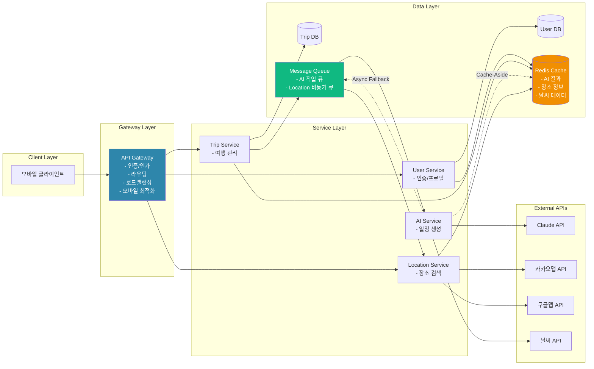
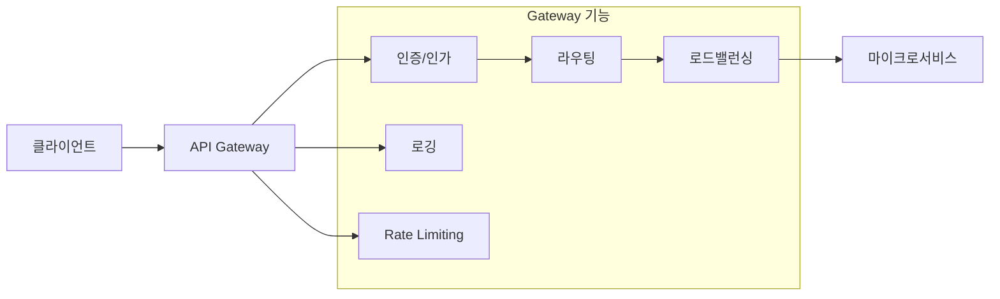
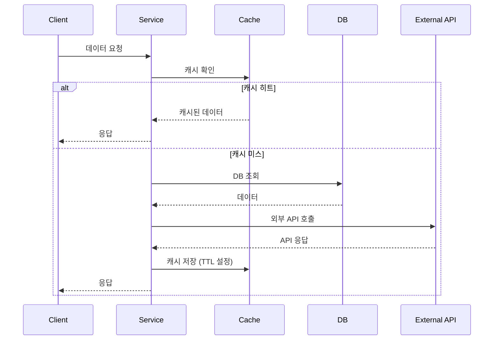
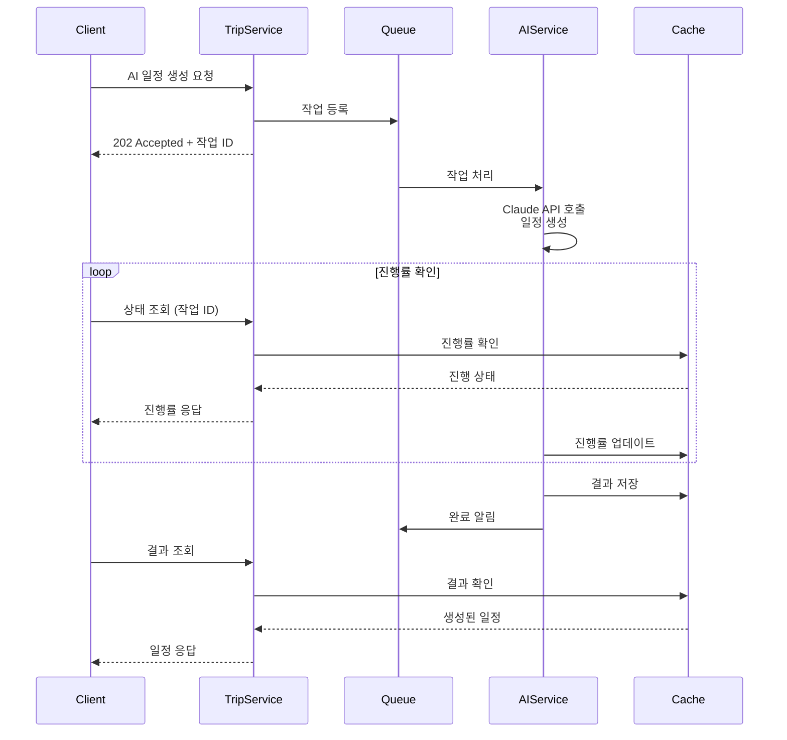
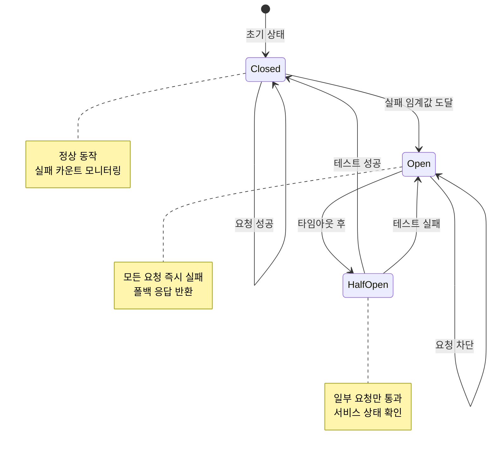
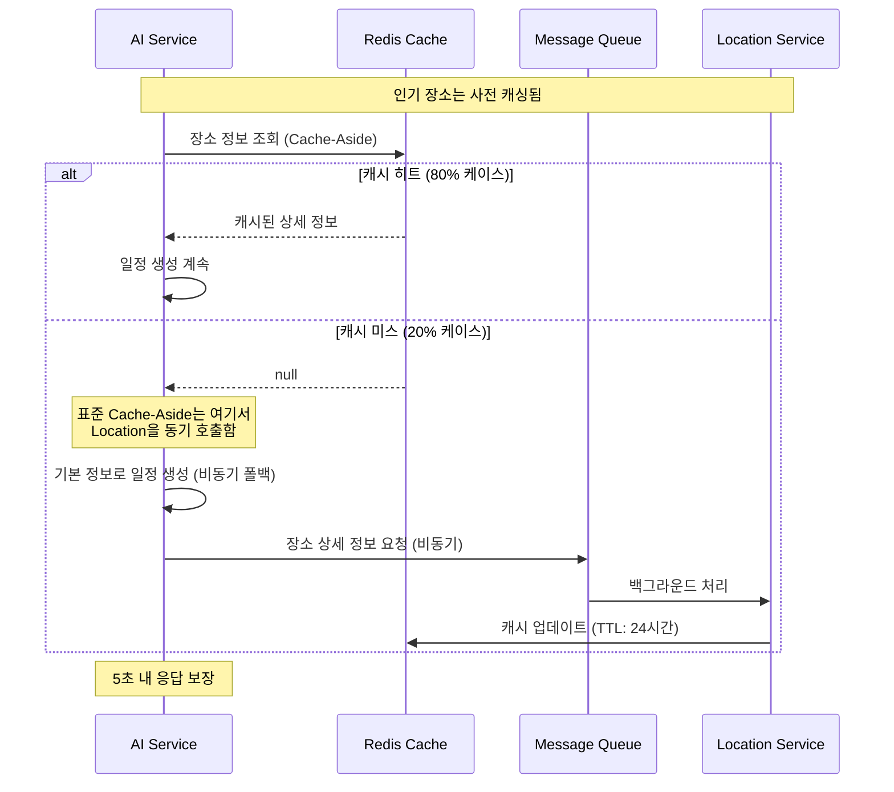
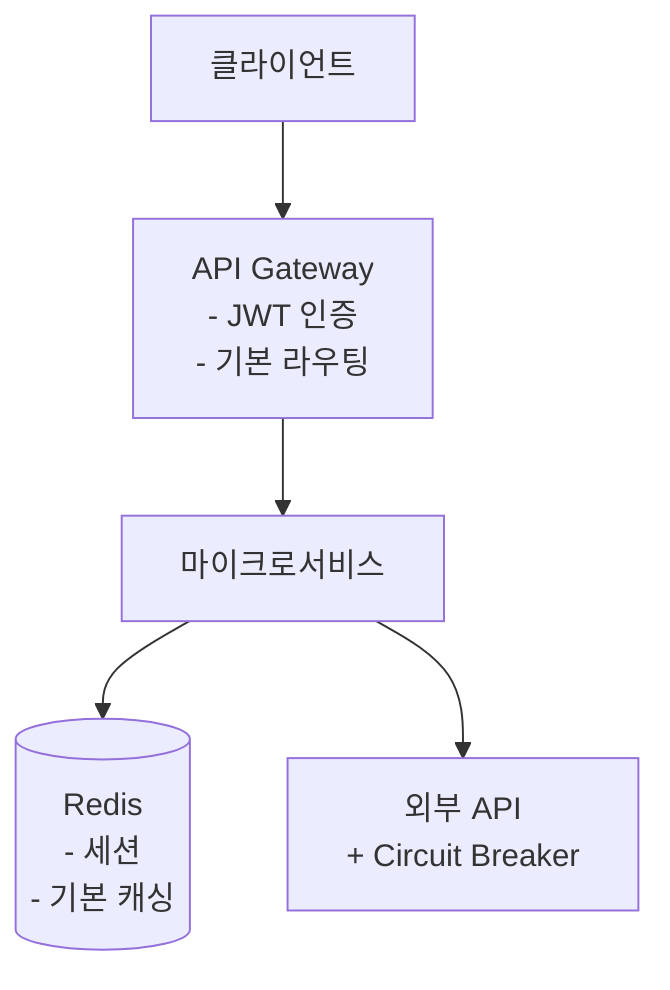
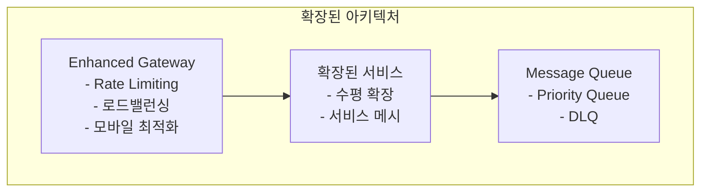
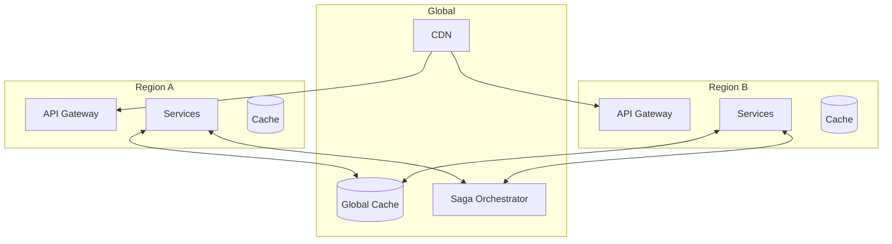

# TripGen 클라우드 아키텍처 패턴 설계서

**프로젝트**: 여행 일정 생성 서비스 (TripGen) - 모바일 전용  
**작성자**: 김개발/테키  
**작성일**: 2025-07-27  
**버전**: 2.1

## 1. 요구사항 분석 결과

### 1.1 기능적 요구사항

#### User 서비스
- 사용자 인증/인가 (회원가입, 로그인, 로그아웃)
- 프로필 관리 (정보 수정, 이미지 업로드)
- 세션 관리 및 로그인 상태 유지

#### Trip 서비스
- 여행 기본정보 관리 (여행명, 멤버, 이동수단)
- 여행지별 일정 설정 (날짜, 숙박 정보)
- AI 일정 생성 요청 및 진행상황 관리
- 생성된 일정 조회/수정/재생성
- 일정 내보내기 (PDF, 이미지)
- 상태별 여행 목록 관리

#### AI 서비스
- Claude API 기반 일정 생성
- 멤버 건강상태/선호도 고려한 최적화
- 날씨 정보 기반 일정 조정
- 이동수단별 경로 최적화
- 장소별 AI 추천 정보 생성

#### Location 서비스
- 주변 장소 검색 (위치, 이동수단, 시간 기반)
- 장소 상세정보 조회
- 지역별 API 자동 선택 (카카오/구글)
- 리뷰 정보 통합 (다중 플랫폼)

### 1.2 비기능적 요구사항

#### 성능 요구사항
- AI 일정 생성 5초 이내 완료
- 동시 요청 처리 10건 이상
- 페이지 로딩 3초 이내
- 실시간 진행률 업데이트

#### 가용성 및 신뢰성
- 99.9% 서비스 가용성
- 외부 API 장애 시 폴백 처리
- 자동 저장 및 데이터 복구
- 트랜잭션 일관성 보장

#### 확장성
- 사용자 증가에 따른 수평 확장
- 마이크로서비스별 독립적 확장
- 캐싱을 통한 부하 분산
- 비동기 처리로 처리량 향상

#### 보안
- JWT 기반 인증/인가
- HTTPS 통신
- API 키 보안 관리
- 사용자 데이터 암호화

### 1.3 기술적 도전과제

1. **AI 응답 시간 관리** (⚠️ 핵심 리스크)
   - Claude API 응답이 5초를 초과할 가능성
   - 다중 외부 API 호출 (날씨, 지도 등)로 인한 지연
   - 복잡한 프롬프트 처리 시간

2. **외부 API 의존성**
   - 카카오맵, 구글맵, 날씨 API 등 다중 의존
   - API 장애 시 서비스 중단 위험
   - API 응답 포맷 변경 대응

3. **복잡한 UI 상태 관리**
   - 일정 조회 화면의 복잡한 상호작용
   - 드래그앤드롭, 실시간 업데이트
   - 다중 탭/카드 상태 동기화

4. **데이터 일관성**
   - 마이크로서비스 간 트랜잭션
   - 일정 생성/수정 시 데이터 정합성
   - 캐시와 DB 간 동기화

5. **성능 최적화**
   - 모바일 환경에서 지도/이미지 렌더링
   - 대용량 일정 데이터 처리
   - 실시간 진행률 업데이트

## 2. 패턴 선정

### 2.1 평가 기준
| 기준 | 가중치 | 평가 내용 |
|------|--------|-----------|
| **기능 적합성** | 35% | 요구사항을 직접 해결하는 능력 |
| **성능 효과** | 25% | 응답시간 및 처리량 개선 효과 |
| **운영 복잡도** | 20% | 구현 및 운영의 용이성 |
| **확장성** | 15% | 미래 요구사항에 대한 대응력 |
| **비용 효율성** | 5% | 개발/운영 비용 대비 효과(ROI) |

### 2.2 패턴별 평가 매트릭스

| 패턴 | 기능 적합성 (35%) | 성능 효과 (25%) | 운영 복잡도 (20%) | 확장성 (15%) | 비용 효율성 (5%) | **총점** |
|------|:---:|:---:|:---:|:---:|:---:|:---:|
| **API Gateway** | 9 × 0.35 = 3.15 | 8 × 0.25 = 2.0 | 8 × 0.20 = 1.6 | 9 × 0.15 = 1.35 | 8 × 0.05 = 0.4 | **8.50** |
| **Cache-Aside** | 8 × 0.35 = 2.8 | 9 × 0.25 = 2.25 | 8 × 0.20 = 1.6 | 8 × 0.15 = 1.2 | 9 × 0.05 = 0.45 | **8.30** |
| **Circuit Breaker** | 9 × 0.35 = 3.15 | 7 × 0.25 = 1.75 | 7 × 0.20 = 1.4 | 8 × 0.15 = 1.2 | 8 × 0.05 = 0.4 | **7.90** |
| **Asynchronous Request-Reply** | 9 × 0.35 = 3.15 | 9 × 0.25 = 2.25 | 6 × 0.20 = 1.2 | 8 × 0.15 = 1.2 | 7 × 0.05 = 0.35 | **8.15** |
| **Saga** | 8 × 0.35 = 2.8 | 7 × 0.25 = 1.75 | 5 × 0.20 = 1.0 | 9 × 0.15 = 1.35 | 6 × 0.05 = 0.3 | **7.20** |
| ~~**Backends for Frontends**~~ | ~~8 × 0.35 = 2.8~~ | ~~8 × 0.25 = 2.0~~ | ~~7 × 0.20 = 1.4~~ | ~~9 × 0.15 = 1.35~~ | ~~7 × 0.05 = 0.35~~ | ~~**7.90**~~ |
| **Priority Queue** | 7 × 0.35 = 2.45 | 8 × 0.25 = 2.0 | 8 × 0.20 = 1.6 | 7 × 0.15 = 1.05 | 8 × 0.05 = 0.4 | **7.50** |
| **Health Endpoint Monitoring** | 7 × 0.35 = 2.45 | 6 × 0.25 = 1.5 | 9 × 0.20 = 1.8 | 7 × 0.15 = 1.05 | 9 × 0.05 = 0.45 | **7.25** |
| **External Configuration Store** | 6 × 0.35 = 2.1 | 6 × 0.25 = 1.5 | 8 × 0.20 = 1.6 | 8 × 0.15 = 1.2 | 8 × 0.05 = 0.4 | **6.80** |

### 2.3 선정된 핵심 패턴

#### 1. **API Gateway Pattern** (점수: 8.50)
- **선정 이유**: 마이크로서비스 통합 관리, 인증/라우팅 중앙화
- **적용 영역**: 모든 클라이언트 요청의 단일 진입점
- **해결 과제**: 서비스 간 통신 복잡도, 횡단 관심사 처리

#### 2. **Cache-Aside Pattern** (점수: 8.30)
- **선정 이유**: AI 응답 시간 단축, 외부 API 부하 감소
- **적용 영역**: AI 생성 결과, 장소 정보, 날씨 데이터
- **해결 과제**: 성능 최적화, API 호출 비용 절감

#### 3. **Asynchronous Request-Reply Pattern** (점수: 8.15)
- **선정 이유**: AI 일정 생성의 긴 처리 시간 대응
- **적용 영역**: AI 서비스의 일정 생성 프로세스
- **해결 과제**: 5초 제한 극복, 실시간 진행률 제공

#### 4. **Circuit Breaker Pattern** (점수: 7.90)
- **선정 이유**: 외부 API 장애 시 연쇄 장애 방지
- **적용 영역**: 카카오맵, 구글맵, 날씨 API 호출
- **해결 과제**: 외부 의존성 관리, 서비스 안정성

#### 5. **Priority Queue Pattern** (점수: 7.50)
- **선정 이유**: AI 일정 생성 요청의 우선순위 관리. 작고 단순한 여행(1인, 단기)을 먼저 처리하여 평균 응답시간 단축 및 시스템 효율성 극대화
- **적용 영역**: 멤버 수, 여행 기간에 따른 작업 우선순위. 대기시간 보너스로 공정성 보장
- **해결 과제**: 동시 요청 처리 효율화, 평균 대기시간 감소, 사용자 만족도 향상

## 3. 적용 설계

### 3.1 전체 아키텍처

### 3.2 패턴별 상세 적용

#### API Gateway 적용

#### Cache-Aside 적용

#### Asynchronous Request-Reply 적용

#### Circuit Breaker 적용

#### Cache-Aside with Async Fallback (AI-Location 통신)

### 3.3 서비스별 패턴 적용 매핑

#### User Service
User Service는 인증과 사용자 관리의 핵심 서비스로서 **API Gateway**, **Cache-Aside**, **Health Endpoint** 패턴을 적용합니다. API Gateway를 통해 인증/인가를 중앙화하여 보안을 강화하고, Cache-Aside 패턴으로 세션 정보를 캐싱하여 반복적인 인증 요청의 부하를 줄입니다. Health Endpoint는 서비스 상태를 지속적으로 모니터링하여 안정성을 보장합니다.

#### Trip Service
Trip Service는 여행 관리의 중심으로 **API Gateway**, **Cache-Aside**, **Saga Pattern**, **Priority Queue** 패턴을 활용합니다. 여행 데이터는 Cache-Aside 패턴으로 캐싱하여 조회 성능을 향상시키고, Saga Pattern으로 여러 서비스에 걸친 분산 트랜잭션을 안전하게 관리합니다. Priority Queue는 AI 일정 생성 요청을 효율적으로 처리하기 위한 작업 우선순위를 관리합니다.

#### AI Service
AI Service는 일정 생성의 핵심으로 **Asynchronous Request-Reply**, **Circuit Breaker**, **Cache-Aside**, **Queue-Based Load Leveling** 패턴을 적용합니다. 비동기 Request-Reply로 5초 제한을 극복하고 실시간 진행률을 제공하며, Circuit Breaker로 Claude API 장애에 대응합니다. 생성된 결과는 Cache-Aside로 캐싱하고, Queue-Based Load Leveling으로 부하를 효과적으로 분산시킵니다.

#### Location Service
Location Service는 장소 정보 제공을 담당하며 **API Gateway**, **Circuit Breaker**, **Cache-Aside**, **Priority Queue** 패턴을 사용합니다. Circuit Breaker로 카카오맵, 구글맵 등 외부 API 장애에 대응하고, Cache-Aside로 장소 정보를 캐싱하여 API 호출을 최소화합니다. Priority Queue는 다수의 검색 요청을 우선순위에 따라 효율적으로 처리합니다.

#### AI-Location 서비스 간 통신 전략 (Cache-Aside with Async Fallback)
AI Service와 Location Service 간 통신은 **Cache-Aside 패턴에 비동기 폴백 전략**을 결합하여 5초 응답 제한을 준수합니다. AI가 장소 정보를 요청할 때 Cache-Aside 패턴에 따라 먼저 Redis 캐시를 확인하고, 캐시 히트 시 즉시 응답합니다. 캐시 미스 시에는 동기 호출 대신 기본 장소 정보를 사용하여 일정을 생성하고, 동시에 비동기로 Location Service에 상세 정보를 요청하여 캐시를 갱신합니다. 이는 표준 Cache-Aside의 블로킹 문제를 해결하는 개선된 구현 방식입니다.

## 4. 구현 계획

### 4.1 Phase 1: MVP (1-2개월)
**목표**: 핵심 기능 구현 및 기본 패턴 적용

#### 구현 내용
- API Gateway 기본 설정 (인증, 라우팅)
- Cache-Aside 패턴 (Redis 기본 캐싱)
- **Cache-Aside with Async Fallback**: AI-Location 통신 최적화
  - 표준 Cache-Aside 패턴 적용
  - 인기 장소 사전 캐싱 (여행지별 TOP 100)
  - 캐시 미스 시 비동기 폴백으로 블로킹 방지
  - 80% 이상 캐시 히트율 목표
- 동기식 AI 일정 생성 (타임아웃 5초)
- 기본 Circuit Breaker (외부 API)

#### 적용 패턴

#### 성공 지표
- 일정 생성 성공률 > 90%
- 평균 응답 시간 < 5초
- 일일 활성 사용자 100명

### 4.2 Phase 2: 확장 (3-4개월)
**목표**: 성능 최적화 및 안정성 강화

#### 구현 내용
- Asynchronous Request-Reply (AI 서비스)
- Priority Queue 패턴 구현 (AI 작업 우선순위)
- 고급 캐싱 전략 (TTL, 무효화)
- Queue-Based Load Leveling

#### 적용 패턴

#### 성공 지표
- 동시 처리 능력 > 50 req/s
- 캐시 히트율 > 80%
- 서비스 가용성 > 99.5%

### 4.3 Phase 3: 고도화 (5-6개월)
**목표**: 엔터프라이즈급 안정성 및 확장성

#### 구현 내용
- Saga 패턴 (분산 트랜잭션)
- 고급 모니터링 및 추적
- 멀티 리전 배포
- 고급 보안 기능

#### 적용 패턴

#### 성공 지표
- 글로벌 서비스 가용성 > 99.9%
- 평균 응답 시간 < 2초
- 일일 활성 사용자 > 10,000명

## 5. 예상 성과 지표

### 5.1 성능 개선
| 지표 | 현재 (예상) | Phase 1 | Phase 2 | Phase 3 |
|------|-------------|----------|----------|----------|
| AI 일정 생성 시간 | 10-15초 | 5-7초 | 3-5초 | 2-3초 |
| API 응답 시간 | 2-3초 | 1-2초 | 500ms-1초 | 200-500ms |
| 동시 처리 능력 | 10 req/s | 20 req/s | 50 req/s | 200 req/s |
| 캐시 히트율 | 0% | 60% | 80% | 90% |

### 5.2 안정성 향상
| 지표 | 현재 (예상) | Phase 1 | Phase 2 | Phase 3 |
|------|-------------|----------|----------|----------|
| 서비스 가용성 | 95% | 99% | 99.5% | 99.9% |
| 장애 복구 시간 | 30분 | 15분 | 5분 | 1분 |
| 데이터 손실률 | 0.1% | 0.05% | 0.01% | 0.001% |

### 5.3 비용 효율성
| 항목 | Phase 1 | Phase 2 | Phase 3 |
|------|----------|----------|----------|
| API 호출 비용 | 기준 | -40% | -60% |
| 인프라 비용 | 기준 | +20% | +10% |
| 운영 인력 | 3명 | 3명 | 4명 |
| **ROI** | - | 150% | 300% |

## 6. 주요 고려사항

### 6.1 기술적 고려사항
- **프롬프트 최적화**: Claude API 응답 시간 단축을 위한 지속적 개선
- **캐시 전략**: 데이터 특성에 따른 TTL 및 무효화 정책 수립
- **모니터링**: 분산 추적 및 로그 집중화를 통한 문제 빠른 감지
- **보안**: API 키 관리, 데이터 암호화, 네트워크 보안

### 6.2 운영 고려사항
- **점진적 마이그레이션**: 기존 시스템과의 호환성 유지
- **롤백 계획**: 각 Phase별 롤백 시나리오 준비
- **팀 교육**: 새로운 패턴 및 기술에 대한 개발팀 교육
- **문서화**: 아키텍처 및 운영 가이드 지속적 업데이트

### 6.3 비즈니스 고려사항
- **사용자 경험**: 점진적 개선으로 서비스 중단 최소화
- **비용 관리**: Phase별 예산 계획 및 ROI 추적
- **확장 계획**: 사용자 증가에 따른 인프라 확장 준비
- **경쟁력**: 빠른 응답 시간과 안정성으로 시장 차별화

## 7. 결론

TripGen 서비스를 위한 클라우드 아키텍처 패턴 선정은 서비스의 핵심 요구사항과 기술적 도전과제를 해결하는데 중점을 두었습니다.

**핵심 선정 패턴**:
1. **API Gateway**: 마이크로서비스 통합 관리
2. **Cache-Aside**: 성능 최적화 및 비용 절감
3. **Asynchronous Request-Reply**: AI 처리 시간 대응
4. **Circuit Breaker**: 외부 의존성 안정화
5. **Priority Queue**: AI 작업 우선순위 관리

이러한 패턴들의 단계적 적용을 통해 안정적이고 확장 가능한 서비스 구축이 가능하며, 예상되는 성과는 다음과 같습니다:
- AI 일정 생성 시간: 10-15초 → 2-3초 (80% 개선)
- 서비스 가용성: 95% → 99.9%
- API 호출 비용: 60% 절감
- Phase 3 완료 시 ROI: 300%

다음 단계는 Phase 1 MVP 구현을 위한 상세 설계 및 개발 착수입니다.