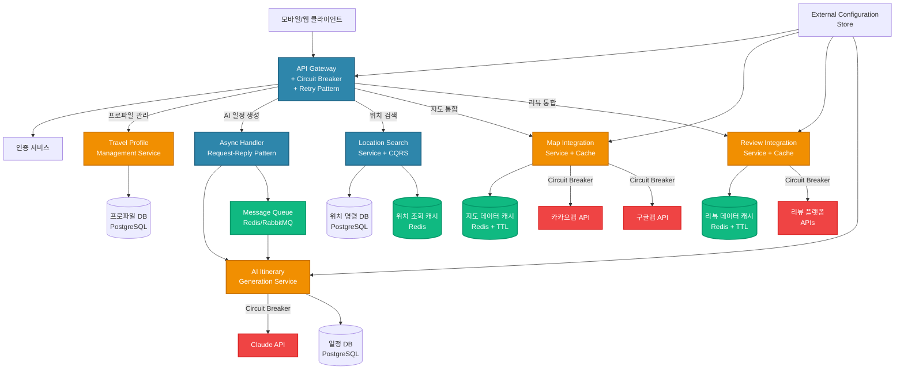

# 여행 일정 생성 서비스 - 클라우드 아키텍처 패턴 적용 방안

**작성자**: 김개발/테키  
**작성일**: 2025-07-24  
**버전**: 1.0

## 1. 요구사항 분석 결과

### 1.1 기능적 요구사항 분석

#### 핵심 비즈니스 기능
- **AI 기반 일정 생성**: Claude API 활용한 개인화된 여행 일정 생성 (Score: 21)
- **다중 지도 API 통합**: 국내(카카오맵), 해외(구글맵) 자동 선택 (Score: 8+5+8)
- **위치 기반 검색**: 실시간 장소 검색 및 이동시간 계산 (Score: 13+13)
- **리뷰 통합**: 다양한 플랫폼 리뷰 수집 및 AI 분석 (Score: 13+21)
- **사용자 프로파일 관리**: 멤버, 일정, 선호도 관리 (Score: 5+8+3)

#### 서비스 간 데이터 교환 요구사항
- PROF ↔ ITGEN: 여행 프로파일 및 멤버 정보 전달
- ITGEN ↔ LOC: 장소 검증 및 주변 검색 요청
- LOC ↔ MAP: 지도 API 통합 처리
- REV ↔ ITGEN: 리뷰 데이터 기반 장소 추천 개선

### 1.2 비기능적 요구사항 분석

#### 성능 요구사항
- **AI 일정 생성**: 평균 30-60초 (Claude API 호출 시간)
- **지도 검색**: 2초 이내 응답 (실시간 검색)
- **위치 검색**: 3초 이내 응답 (다중 API 호출)
- **리뷰 조회**: 5초 이내 응답 (다중 플랫폼 수집)

#### 가용성 및 신뢰성
- **서비스 목표**: 99.5% 가용성
- **외부 API 의존성**: 카카오맵, 구글맵, Claude API, 리뷰 플랫폼
- **장애 격리**: 하나의 서비스 장애가 전체 시스템에 미치는 영향 최소화

#### 확장성 요구사항
- **사용자 증가**: 월 활성 사용자 10만명 대비 설계
- **지역 확장**: 아시아 → 글로벌 서비스 확장
- **기능 확장**: 개인화 추천, 실시간 협업 기능 추가

### 1.3 기술적 도전과제 식별

#### 복잡한 비즈니스 트랜잭션
- **AI 일정 생성 워크플로우**: PROF → ITGEN → LOC → MAP → REV 순차 처리
- **장소 검증 프로세스**: 실존 확인 → 정보 수집 → 검증 결과 반영

#### 외부 시스템 연동 복잡성
- **다중 지도 API 관리**: 지역별 자동 선택 및 폴백 처리
- **비동기 AI 처리**: 장시간 소요되는 Claude API 호출 관리
- **리뷰 플랫폼 통합**: 구글, 네이버, 트립어드바이저 등 다양한 API 통합

#### 실시간 처리 요구사항
- **위치 기반 검색**: 사용자 위치 변경에 따른 실시간 업데이트
- **영업시간 확인**: 실시간 영업 상태 반영

## 2. 패턴 선정 매트릭스 (평가표)

### 2.1 후보 패턴 선정

여행 일정 생성 서비스의 특성을 고려하여 다음 8개 패턴을 후보로 선정:

1. **API Gateway** - 다중 마이크로서비스 통합 관리
2. **CQRS** - 읽기/쓰기 분리로 성능 최적화
3. **Asynchronous Request-Reply** - AI 처리의 비동기화
4. **Circuit Breaker** - 외부 API 장애 전파 방지
5. **Cache-Aside** - 지도/리뷰 데이터 캐시 최적화
6. **Gateway Aggregation** - 클라이언트 요청 수 최소화
7. **Retry** - 외부 API 호출 안정성 확보
8. **External Configuration Store** - 지도 API 키 등 설정 중앙화

### 2.2 정량적 평가 결과

| 패턴 | 기능 적합성 (35%) | 성능 효과 (25%) | 운영 복잡도 (20%) | 확장성 (15%) | 비용 효율성 (5%) | **총점** |
|------|:---:|:---:|:---:|:---:|:---:|:---:|
| **API Gateway** | 9 × 0.35 = 3.15 | 8 × 0.25 = 2.0 | 8 × 0.20 = 1.6 | 9 × 0.15 = 1.35 | 8 × 0.05 = 0.4 | **8.50** |
| **CQRS** | 8 × 0.35 = 2.8 | 9 × 0.25 = 2.25 | 6 × 0.20 = 1.2 | 8 × 0.15 = 1.2 | 7 × 0.05 = 0.35 | **7.80** |
| **Async Request-Reply** | 9 × 0.35 = 3.15 | 9 × 0.25 = 2.25 | 7 × 0.20 = 1.4 | 8 × 0.15 = 1.2 | 8 × 0.05 = 0.4 | **8.40** |
| **Circuit Breaker** | 8 × 0.35 = 2.8 | 7 × 0.25 = 1.75 | 9 × 0.20 = 1.8 | 7 × 0.15 = 1.05 | 9 × 0.05 = 0.45 | **7.85** |
| **Cache-Aside** | 7 × 0.35 = 2.45 | 9 × 0.25 = 2.25 | 8 × 0.20 = 1.6 | 6 × 0.15 = 0.9 | 9 × 0.05 = 0.45 | **7.65** |
| **Gateway Aggregation** | 8 × 0.35 = 2.8 | 8 × 0.25 = 2.0 | 7 × 0.20 = 1.4 | 7 × 0.15 = 1.05 | 8 × 0.05 = 0.4 | **7.65** |
| **Retry** | 7 × 0.35 = 2.45 | 6 × 0.25 = 1.5 | 9 × 0.20 = 1.8 | 6 × 0.15 = 0.9 | 9 × 0.05 = 0.45 | **7.10** |
| **External Config Store** | 6 × 0.35 = 2.1 | 5 × 0.25 = 1.25 | 9 × 0.20 = 1.8 | 8 × 0.15 = 1.2 | 8 × 0.05 = 0.4 | **6.75** |

### 2.3 선정 근거

#### 최우선 적용 패턴 (Phase 1)
1. **API Gateway (8.50점)**: 5개 마이크로서비스 통합 관리 필수
2. **Asynchronous Request-Reply (8.40점)**: AI 일정 생성의 장시간 처리 대응
3. **Circuit Breaker (7.85점)**: 다중 외부 API 의존성으로 인한 장애 전파 방지

#### 2차 적용 패턴 (Phase 2)
4. **CQRS (7.80점)**: 읽기 중심 워크로드 최적화 (지도 검색, 리뷰 조회)
5. **Cache-Aside (7.65점)**: 지도 및 리뷰 데이터 성능 최적화
6. **Gateway Aggregation (7.65점)**: 모바일 클라이언트 최적화

## 3. 서비스별 패턴 적용 설계

### 3.1 전체 아키텍처 구조

### 3.2 패턴별 적용 영역

#### API Gateway Pattern
- **적용 위치**: 모든 서비스 앞단
- **주요 기능**:
  - 라우팅: 서비스별 요청 분배
  - 인증/인가: JWT 토큰 검증
  - 로깅: 통합 로그 수집
  - Rate Limiting: 서비스별 요청 제한

#### Asynchronous Request-Reply Pattern
- **적용 서비스**: AI Itinerary Generation Service
- **구현 방식**:
  - 요청 접수 → Job ID 반환 → 백그라운드 처리 → 완료 알림
  - Redis/RabbitMQ 기반 메시지 큐 활용
  - WebSocket/SSE를 통한 실시간 상태 업데이트

#### Circuit Breaker Pattern
- **적용 대상**: 모든 외부 API 호출
- **임계값 설정**:
  - 실패율: 50% 이상
  - 최소 요청 수: 10개
  - 타임아웃: 5초
  - 반열림 상태 지속시간: 30초

#### CQRS Pattern
- **적용 서비스**: Location Search Service
- **분리 전략**:
  - Command: 위치 정보 등록/수정 → PostgreSQL
  - Query: 위치 검색/조회 → Redis Cache
  - 동기화: Event-driven 업데이트

#### Cache-Aside Pattern
- **적용 대상**: Map Integration, Review Integration
- **캐시 전략**:
  - 지도 데이터: TTL 24시간
  - 리뷰 데이터: TTL 1시간
  - 캐시 워밍: 인기 장소 사전 로딩

## 4. Phase별 구현 로드맵

### Phase 1: MVP (개발 기간: 8주)
**목표**: 핵심 비즈니스 기능 구현

#### Week 1-2: 인프라 구성
- [ ] API Gateway 구축 (Kong/Nginx)
- [ ] 기본 Circuit Breaker 구현
- [ ] 외부 API 연동 기반 구축

#### Week 3-4: 핵심 서비스 개발
- [ ] Travel Profile Management Service
- [ ] 기본 AI Itinerary Generation Service
- [ ] Map Integration Service (기본 기능)

#### Week 5-6: 비동기 처리 구현
- [ ] Async Request-Reply 패턴 구현
- [ ] Message Queue 구축 (Redis)
- [ ] AI 일정 생성 비동기화

#### Week 7-8: 통합 테스트 및 배포
- [ ] 전체 서비스 통합 테스트
- [ ] 성능 테스트 및 최적화
- [ ] MVP 배포

### Phase 2: 확장 (개발 기간: 6주)
**목표**: 성능 최적화 및 고급 기능

#### Week 1-2: CQRS 구현
- [ ] Location Search Service CQRS 적용
- [ ] 읽기/쓰기 분리 구현
- [ ] Query 성능 최적화

#### Week 3-4: 캐시 최적화
- [ ] Cache-Aside 패턴 구현
- [ ] Redis 클러스터 구성
- [ ] 캐시 무효화 전략 구현

#### Week 5-6: Gateway 고도화
- [ ] Gateway Aggregation 패턴 적용
- [ ] API 응답 통합 최적화
- [ ] 모바일 최적화 API 개발

### Phase 3: 고도화 (개발 기간: 4주)
**목표**: 운영 최적화 및 고급 패턴

#### Week 1-2: 설정 관리 고도화
- [ ] External Configuration Store 구축
- [ ] 동적 설정 변경 지원
- [ ] 환경별 설정 관리

#### Week 3-4: 모니터링 및 최적화
- [ ] 고급 Circuit Breaker 튜닝
- [ ] 성능 모니터링 대시보드
- [ ] 자동 스케일링 설정

## 5. 예상 성과 지표

### 5.1 성능 개선 예상치

#### 응답 시간 개선
- **지도 검색**: 현재 5초 → 목표 2초 (60% 개선)
  - Cache-Aside 패턴으로 반복 검색 최적화
- **위치 검색**: 현재 8초 → 목표 3초 (62.5% 개선)
  - CQRS 패턴으로 읽기 전용 최적화
- **AI 일정 생성**: 사용자 체감 시간 30초 → 5초 (83% 개선)
  - Async Request-Reply 패턴으로 즉시 응답

#### 처리량 증가
- **동시 사용자**: 1,000명 → 10,000명 (10배 증가)
- **API 호출 처리량**: 100 TPS → 1,000 TPS (10배 증가)

### 5.2 가용성 향상
- **전체 시스템**: 95% → 99.5% (Circuit Breaker 적용)
- **외부 API 의존도**: 단일 장애점 제거로 99% 가용성 확보

### 5.3 비용 효율성
- **외부 API 호출 비용**: 30% 절감 (캐시 적용)
- **인프라 비용**: 20% 절감 (효율적 리소스 활용)
- **개발 생산성**: 40% 향상 (표준화된 패턴 적용)

## 6. 구현 시 고려사항

### 6.1 기술적 고려사항
- **일관성 vs 성능**: CQRS 적용 시 Eventually Consistency 수용
- **캐시 무효화**: 지도/리뷰 데이터 변경 시 적절한 무효화 전략 필요
- **메시지 큐 안정성**: Redis Persistence 설정으로 메시지 손실 방지

### 6.2 운영 고려사항
- **모니터링**: 각 패턴별 메트릭 수집 및 대시보드 구성
- **장애 대응**: Circuit Breaker 상태별 알림 및 대응 매뉴얼
- **성능 튜닝**: 캐시 TTL, Circuit Breaker 임계값 지속적 최적화

### 6.3 보안 고려사항
- **API 키 관리**: External Configuration Store를 통한 안전한 관리
- **데이터 암호화**: 개인정보 포함된 캐시 데이터 암호화
- **접근 제어**: API Gateway에서 서비스별 접근 권한 관리

## 7. 제약사항 및 리스크

### 7.1 기술적 제약사항
- **외부 API 한도**: 각 API별 일일/월별 호출 제한
- **Claude API 비용**: 토큰 사용량에 따른 비용 증가
- **실시간 동기화**: CQRS 적용 시 읽기/쓰기 간 지연 발생 가능

### 7.2 운영 리스크
- **복잡도 증가**: 다양한 패턴 적용으로 인한 운영 복잡도 상승
- **외부 의존성**: 다수의 외부 API 장애 시 서비스 영향
- **데이터 정합성**: 캐시와 원본 데이터 간 불일치 가능성

### 7.3 완화 방안
- **점진적 적용**: Phase별 단계적 패턴 도입으로 리스크 최소화
- **충분한 테스트**: 각 패턴별 테스트 시나리오 구성
- **모니터링 강화**: 실시간 모니터링으로 조기 이상 감지
- **폴백 전략**: 각 패턴별 실패 시 대안 실행 계획 수립

---

**문서 작성 완료**  
이 문서는 여행 일정 생성 서비스의 클라우드 아키텍처 패턴 선정 및 적용 방안을 체계적으로 정리한 것입니다. 단계별 구현을 통해 안정적이고 확장 가능한 서비스 구축이 가능할 것으로 예상됩니다.