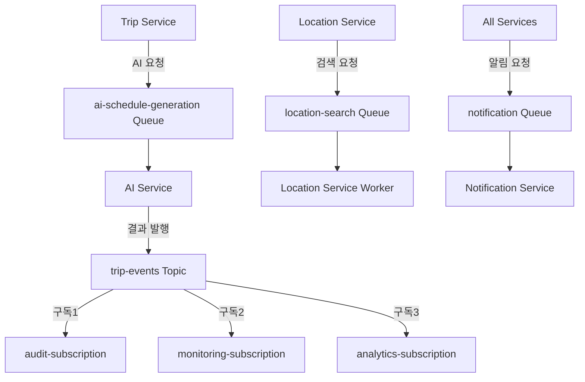

# Message Queue 설치계획서 - 운영환경

## 1. 설치 계획 개요

### 1.1 설치 목적
- AI 기반 여행 일정 생성 서비스의 **운영환경** Message Queue 구축
- 고가용성, 확장성, 보안을 고려한 엔터프라이즈급 메시징 시스템 구현
- 99.9% 가용성과 10만 동시 사용자 지원을 위한 안정적인 비동기 처리

### 1.2 설치 범위
- **대상 환경**: 운영환경 (tripgen-prod)
- **Message Queue**: Azure Service Bus Premium Tier
- **배포 방식**: Managed Identity + Private Endpoint 기반
- **설치 대상**: 큐 3개, 토픽 1개, 구독 3개

### 1.3 참조 문서
- 물리 아키텍처: design/backend/physical/physical-architecture-prod.md
- 백킹서비스설치방법: claude/backing-service-method.md
- 개발환경 계획서: develop/mq/plan/mq-plan-dev.md

## 2. 환경 분석

### 2.1 현재 시스템 구성
- **Kubernetes 클러스터**: AKS Premium Multi-Zone (tripgen-prod namespace)
- **노드 풀**: Standard_D8s_v3 × 6개 (Reserved Instance)
- **네트워크**: VNet 10.1.0.0/16, Private Endpoint Subnet 10.1.4.0/24
- **보안 수준**: 엔터프라이즈급 다층 보안

### 2.2 Message Queue 요구사항

#### 2.2.1 비즈니스 요구사항
| 요구사항 | 설명 | SLA 목표 |
|----------|------|----------|
| AI 일정 생성 처리 | 대용량 AI 요청 비동기 처리 | 5초 이내 완료 |
| 위치 검색 요청 | 동시 검색 요청 처리 | 1초 이내 응답 |
| 실시간 알림 | 사용자 알림 즉시 전송 | 500ms 이내 전송 |
| 이벤트 추적 | 감사 및 분석용 이벤트 수집 | 100% 수집률 |
| 재해복구 | 메시지 손실 방지 | RPO 15분, RTO 30분 |

#### 2.2.2 기술적 요구사항
| 구분 | 요구사항 | 운영환경 목표값 |
|------|----------|----------------|
| 처리량 | 초당 메시지 처리 | 10,000 msg/sec |
| 응답시간 | 메시지 처리 지연시간 | 100ms 이내 |
| 가용성 | 서비스 가용성 | 99.9% |
| 메시지 크기 | 최대 메시지 크기 | 1MB |
| 큐 크기 | 큐당 최대 크기 | 80GB |
| 보존 기간 | 메시지 TTL | 7일 (감사용 30일) |
| 동시 연결 | 최대 동시 연결 수 | 5,000개 |

### 2.3 운영환경 메시징 아키텍처

#### 2.3.1 메시지 플로우 설계


#### 2.3.2 메시지 타입 정의
```yaml
message_types:
  ai_schedule_generation:
    - GenerateScheduleRequest
    - RegenerateScheduleRequest
    - ScheduleValidationRequest
    
  location_search:
    - NearbySearchRequest
    - RouteCalculationRequest
    - WeatherInfoRequest
    
  notification:
    - ScheduleCompleteNotification
    - ErrorNotification
    - SystemAlertNotification
    
  trip_events:
    - TripCreatedEvent
    - ScheduleGeneratedEvent
    - TripCompletedEvent
    - TripCancelledEvent
```

## 3. 설치 계획

### 3.1 Azure Service Bus Premium 설치 계획

#### 3.1.1 네임스페이스 구성
| 설정 항목 | 값 | 설명 |
|-----------|----|---------|
| 네임스페이스명 | sb-tripgen-prod | 운영환경 전용 |
| SKU | Premium | 엔터프라이즈급 기능 |
| Messaging Units | 4 | 고성능 처리량 |
| 위치 | Korea Central | 메인 리전 |
| Geo-DR | Korea South | 재해복구 쌍 리전 |
| Private Endpoint | 활성화 | VNet 내부 접근만 |
| Managed Identity | 활성화 | 보안 강화 |

#### 3.1.2 큐 및 토픽 상세 설계
```yaml
queues:
  ai-schedule-generation:
    max_size: 80GB
    duplicate_detection: true
    duplicate_detection_window: PT10M
    session_support: true
    partitioning: true
    max_delivery_count: 3
    dead_letter_queue: enabled
    auto_delete_idle: P7D
    
  location-search:
    max_size: 80GB
    duplicate_detection: false
    session_support: false
    partitioning: true
    max_delivery_count: 5
    auto_delete_idle: P1D
    
  notification:
    max_size: 80GB
    duplicate_detection: true
    duplicate_detection_window: PT5M
    session_support: false
    partitioning: true
    max_delivery_count: 10
    auto_delete_idle: P1D

topics:
  trip-events:
    max_size: 80GB
    duplicate_detection: true
    duplicate_detection_window: PT30M
    enable_partitioning: true
    enable_filtering: true
    subscriptions:
      audit-subscription:
        requires_session: false
        max_delivery_count: 1
        dead_letter_queue: enabled
        auto_delete_idle: P30D  # 감사용 장기 보존
        
      monitoring-subscription:
        requires_session: false
        max_delivery_count: 3
        enable_batched_operations: true
        auto_delete_idle: P7D
        
      analytics-subscription:
        requires_session: false
        max_delivery_count: 1
        auto_delete_idle: P7D
```

### 3.2 네트워크 보안 설계

#### 3.2.1 Private Endpoint 구성
```yaml
private_endpoint_configuration:
  name: pe-servicebus-prod
  subnet: private-endpoint-subnet (10.1.4.0/24)
  network_interface: 
    private_ip: 10.1.4.10
    dns_name: sb-tripgen-prod.privatelink.servicebus.windows.net
    
  dns_integration:
    private_dns_zone: privatelink.servicebus.windows.net
    auto_registration: enabled
    
  network_policies:
    service_endpoint_policies: disabled
    network_security_group: pe-servicebus-nsg
```

#### 3.2.2 Managed Identity 권한 설계
```yaml
managed_identity_configuration:
  system_assigned:
    name: tripgen-services-identity
    scope: /subscriptions/<sub-id>/resourceGroups/rg-tripgen-prod
    
  role_assignments:
    - role: "Azure Service Bus Data Owner"
      scope: "namespace level"
      services: [trip-service, ai-service, location-service]
      
    - role: "Azure Service Bus Data Sender"
      scope: "queue level"
      services: [trip-service, location-service]
      
    - role: "Azure Service Bus Data Receiver"
      scope: "queue level"
      services: [ai-service, notification-service]
```

## 4. 설치 절차

### 4.1 사전 준비사항

#### 4.1.1 필수 도구 및 권한
```bash
# Azure CLI 최신버전 확인
az --version  # >= 2.50.0

# PowerShell 모듈 (Windows)
Install-Module -Name Az -Force

# kubectl 및 Helm 확인
kubectl version --client
helm version

# Azure 권한 확인
az account show --query '{subscriptionId:id,tenantId:tenantId,name:name}'
```

#### 4.1.2 네트워크 사전 구성 확인
```bash
# VNet 및 서브넷 확인
az network vnet show --name vnet-tripgen-prod --resource-group rg-tripgen-prod
az network vnet subnet show --vnet-name vnet-tripgen-prod --name private-endpoint-subnet --resource-group rg-tripgen-prod

# AKS 클러스터 연결
az aks get-credentials --resource-group rg-tripgen-prod --name aks-tripgen-prod --admin
```

### 4.2 단계별 설치 절차

#### 4.2.1 Phase 1: Azure Service Bus Premium 생성
```bash
#!/bin/bash
# Phase 1: Service Bus Premium 설치

echo "=== Phase 1: Azure Service Bus Premium 설치 ==="

# 1단계: Premium 네임스페이스 생성
echo "1. Service Bus Premium 네임스페이스 생성..."
az servicebus namespace create \
  --name sb-tripgen-prod \
  --resource-group rg-tripgen-prod \
  --location koreacentral \
  --sku Premium \
  --capacity 4

# 2단계: Geo-DR 설정
echo "2. Geo-DR 재해복구 설정..."
az servicebus namespace create \
  --name sb-tripgen-prod-dr \
  --resource-group rg-tripgen-prod-dr \
  --location koreasouth \
  --sku Premium \
  --capacity 2

az servicebus georecovery-alias create \
  --resource-group rg-tripgen-prod \
  --namespace-name sb-tripgen-prod \
  --alias tripgen-dr \
  --partner-namespace "/subscriptions/<sub-id>/resourceGroups/rg-tripgen-prod-dr/providers/Microsoft.ServiceBus/namespaces/sb-tripgen-prod-dr"

# 3단계: Managed Identity 생성
echo "3. Managed Identity 생성..."
IDENTITY_ID=$(az identity create \
  --name tripgen-servicebus-identity \
  --resource-group rg-tripgen-prod \
  --query principalId -o tsv)

# 4단계: 권한 부여
echo "4. Service Bus 권한 부여..."
az role assignment create \
  --assignee $IDENTITY_ID \
  --role "Azure Service Bus Data Owner" \
  --scope "/subscriptions/$(az account show --query id -o tsv)/resourceGroups/rg-tripgen-prod/providers/Microsoft.ServiceBus/namespaces/sb-tripgen-prod"

echo "Phase 1 완료"
```

#### 4.2.2 Phase 2: 큐 및 토픽 생성
```bash
#!/bin/bash
# Phase 2: 큐 및 토픽 생성

echo "=== Phase 2: 큐 및 토픽 생성 ==="

NAMESPACE="sb-tripgen-prod"
RESOURCE_GROUP="rg-tripgen-prod"

# 1단계: AI 일정 생성 큐 (Session 지원)
echo "1. AI 일정 생성 큐 생성..."
az servicebus queue create \
  --namespace-name $NAMESPACE \
  --resource-group $RESOURCE_GROUP \
  --name ai-schedule-generation \
  --max-size 81920 \
  --enable-duplicate-detection true \
  --duplicate-detection-history-time-window PT10M \
  --enable-session true \
  --enable-partitioning true \
  --max-delivery-count 3 \
  --enable-dead-lettering-on-message-expiration true

# 2단계: 위치 검색 큐
echo "2. 위치 검색 큐 생성..."
az servicebus queue create \
  --namespace-name $NAMESPACE \
  --resource-group $RESOURCE_GROUP \
  --name location-search \
  --max-size 81920 \
  --enable-duplicate-detection false \
  --enable-partitioning true \
  --max-delivery-count 5 \
  --auto-delete-on-idle P1D

# 3단계: 알림 큐
echo "3. 알림 큐 생성..."
az servicebus queue create \
  --namespace-name $NAMESPACE \
  --resource-group $RESOURCE_GROUP \
  --name notification \
  --max-size 81920 \
  --enable-duplicate-detection true \
  --duplicate-detection-history-time-window PT5M \
  --enable-partitioning true \
  --max-delivery-count 10 \
  --auto-delete-on-idle P1D

# 4단계: 여행 이벤트 토픽 생성
echo "4. 여행 이벤트 토픽 생성..."
az servicebus topic create \
  --namespace-name $NAMESPACE \
  --resource-group $RESOURCE_GROUP \
  --name trip-events \
  --max-size 81920 \
  --enable-duplicate-detection true \
  --duplicate-detection-history-time-window PT30M \
  --enable-partitioning true

# 5단계: 구독 생성
echo "5. 토픽 구독 생성..."

# 감사용 구독 (장기 보존)
az servicebus topic subscription create \
  --namespace-name $NAMESPACE \
  --resource-group $RESOURCE_GROUP \
  --topic-name trip-events \
  --name audit-subscription \
  --max-delivery-count 1 \
  --enable-dead-lettering-on-message-expiration true \
  --auto-delete-on-idle P30D

# 모니터링용 구독
az servicebus topic subscription create \
  --namespace-name $NAMESPACE \
  --resource-group $RESOURCE_GROUP \
  --topic-name trip-events \
  --name monitoring-subscription \
  --max-delivery-count 3 \
  --enable-batched-operations true \
  --auto-delete-on-idle P7D

# 분석용 구독
az servicebus topic subscription create \
  --namespace-name $NAMESPACE \
  --resource-group $RESOURCE_GROUP \
  --topic-name trip-events \
  --name analytics-subscription \
  --max-delivery-count 1 \
  --auto-delete-on-idle P7D

echo "Phase 2 완료"
```

#### 4.2.3 Phase 3: 네트워크 보안 설정
```bash
#!/bin/bash
# Phase 3: 네트워크 보안 설정

echo "=== Phase 3: 네트워크 보안 설정 ==="

NAMESPACE="sb-tripgen-prod"
RESOURCE_GROUP="rg-tripgen-prod"
VNET_NAME="vnet-tripgen-prod"
SUBNET_NAME="private-endpoint-subnet"

# 1단계: Network Rules 설정 (VNet만 허용)
echo "1. 네트워크 액세스 규칙 설정..."
az servicebus namespace network-rule add \
  --namespace-name $NAMESPACE \
  --resource-group $RESOURCE_GROUP \
  --action Allow \
  --vnet-name $VNET_NAME \
  --subnet $SUBNET_NAME

# Public 액세스 비활성화
az servicebus namespace update \
  --name $NAMESPACE \
  --resource-group $RESOURCE_GROUP \
  --enable-public-network false

# 2단계: Private Endpoint 생성
echo "2. Private Endpoint 생성..."
az network private-endpoint create \
  --name pe-servicebus-prod \
  --resource-group $RESOURCE_GROUP \
  --vnet-name $VNET_NAME \
  --subnet $SUBNET_NAME \
  --private-connection-resource-id "/subscriptions/$(az account show --query id -o tsv)/resourceGroups/$RESOURCE_GROUP/providers/Microsoft.ServiceBus/namespaces/$NAMESPACE" \
  --connection-name servicebus-connection \
  --group-id namespace

# 3단계: Private DNS Zone 생성
echo "3. Private DNS Zone 설정..."
az network private-dns zone create \
  --resource-group $RESOURCE_GROUP \
  --name privatelink.servicebus.windows.net

az network private-dns link vnet create \
  --resource-group $RESOURCE_GROUP \
  --zone-name privatelink.servicebus.windows.net \
  --name servicebus-dns-link \
  --virtual-network $VNET_NAME \
  --registration-enabled false

# 4단계: DNS A 레코드 생성
PRIVATE_IP=$(az network private-endpoint show \
  --name pe-servicebus-prod \
  --resource-group $RESOURCE_GROUP \
  --query 'networkInterfaces[0].ipConfigurations[0].privateIpAddress' -o tsv)

az network private-dns record-set a create \
  --resource-group $RESOURCE_GROUP \
  --zone-name privatelink.servicebus.windows.net \
  --name sb-tripgen-prod

az network private-dns record-set a add-record \
  --resource-group $RESOURCE_GROUP \
  --zone-name privatelink.servicebus.windows.net \
  --record-set-name sb-tripgen-prod \
  --ipv4-address $PRIVATE_IP

echo "Phase 3 완료"
```

#### 4.2.4 Phase 4: Kubernetes 통합
```bash
#!/bin/bash
# Phase 4: Kubernetes 통합

echo "=== Phase 4: Kubernetes 통합 ==="

# 1단계: Workload Identity 설정
echo "1. Workload Identity 설정..."
az aks update \
  --resource-group rg-tripgen-prod \
  --name aks-tripgen-prod \
  --enable-workload-identity \
  --enable-oidc-issuer

# OIDC Issuer URL 획득
OIDC_ISSUER=$(az aks show --resource-group rg-tripgen-prod --name aks-tripgen-prod --query "oidcIssuerProfile.issuerUrl" -o tsv)

# 2단계: Federated Credential 생성
echo "2. Federated Credential 생성..."
az identity federated-credential create \
  --name tripgen-servicebus-federated \
  --identity-name tripgen-servicebus-identity \
  --resource-group rg-tripgen-prod \
  --issuer $OIDC_ISSUER \
  --subject system:serviceaccount:tripgen-prod:servicebus-workload-identity

# 3단계: Kubernetes 리소스 배포
echo "3. Kubernetes 리소스 배포..."
kubectl apply -f k8s/prod/servicebus/

echo "Phase 4 완료"
```

### 4.3 Kubernetes 리소스 정의

#### 4.3.1 Service Account (Workload Identity)
```yaml
# servicebus-workload-identity.yaml
apiVersion: v1
kind: ServiceAccount
metadata:
  name: servicebus-workload-identity
  namespace: tripgen-prod
  annotations:
    azure.workload.identity/client-id: <managed-identity-client-id>
  labels:
    azure.workload.identity/use: "true"
```

#### 4.3.2 ConfigMap (운영환경 설정)
```yaml
# servicebus-config-prod.yaml
apiVersion: v1
kind: ConfigMap
metadata:
  name: servicebus-config
  namespace: tripgen-prod
data:
  SERVICEBUS_NAMESPACE: "sb-tripgen-prod.servicebus.windows.net"
  SERVICEBUS_ENDPOINT: "https://sb-tripgen-prod.privatelink.servicebus.windows.net"
  CONNECTION_TYPE: "managed_identity"
  
  # 큐 설정
  AI_QUEUE_NAME: "ai-schedule-generation"
  LOCATION_QUEUE_NAME: "location-search"
  NOTIFICATION_QUEUE_NAME: "notification"
  TRIP_EVENTS_TOPIC: "trip-events"
  
  # 구독 설정
  AUDIT_SUBSCRIPTION: "audit-subscription"
  MONITORING_SUBSCRIPTION: "monitoring-subscription"
  ANALYTICS_SUBSCRIPTION: "analytics-subscription"
  
  # 연결 설정
  CONNECTION_TIMEOUT: "30"
  MAX_RETRY_COUNT: "3"
  RETRY_DELAY: "PT1S"
  MAX_RETRY_DELAY: "PT30S"
  
  # 세션 설정
  AI_QUEUE_SESSION_SUPPORT: "true"
  SESSION_TIMEOUT: "PT5M"
  
  # 배치 설정
  ENABLE_BATCHED_OPERATIONS: "true"
  MAX_BATCH_SIZE: "100"
  BATCH_TIMEOUT: "PT1S"
```

#### 4.3.3 Network Policy (보안 강화)
```yaml
# servicebus-network-policy.yaml
apiVersion: networking.k8s.io/v1
kind: NetworkPolicy
metadata:
  name: servicebus-access-policy
  namespace: tripgen-prod
spec:
  podSelector:
    matchLabels:
      servicebus-access: "true"
  policyTypes:
  - Egress
  egress:
  - to:
    - ipBlock:
        cidr: 10.1.4.0/24  # Private Endpoint Subnet
    ports:
    - protocol: TCP
      port: 5671  # AMQP over TLS
    - protocol: TCP
      port: 443   # HTTPS
  - to: []  # DNS 확인용
    ports:
    - protocol: UDP
      port: 53
```

## 5. 애플리케이션 통합

### 5.1 Spring Boot 운영환경 설정

#### 5.1.1 application-prod.yml
```yaml
spring:
  cloud:
    azure:
      servicebus:
        namespace: ${SERVICEBUS_NAMESPACE}
        credential:
          managed-identity-enabled: true
          client-id: ${AZURE_CLIENT_ID}
        
management:
  endpoint:
    servicebus:
      enabled: true
  endpoints:
    web:
      exposure:
        include: health,metrics,info,servicebus,prometheus
        
servicebus:
  connection:
    retry-options:
      max-retries: 3
      delay: PT1S
      max-delay: PT30S
      retry-mode: EXPONENTIAL
    
  producer:
    ai-queue:
      queue-name: ${AI_QUEUE_NAME}
      session-support: true
      enable-partitioning: true
    location-queue:
      queue-name: ${LOCATION_QUEUE_NAME}
      enable-partitioning: true
    notification-queue:
      queue-name: ${NOTIFICATION_QUEUE_NAME}
      enable-partitioning: true
      
  consumer:
    ai-consumer:
      queue-name: ${AI_QUEUE_NAME}
      receive-mode: PEEK_LOCK
      session-support: true
      max-auto-renew-duration: PT10M
      prefetch-count: 10
    location-consumer:
      queue-name: ${LOCATION_QUEUE_NAME}
      receive-mode: PEEK_LOCK
      max-auto-renew-duration: PT5M
      prefetch-count: 20
    notification-consumer:
      queue-name: ${NOTIFICATION_QUEUE_NAME}
      receive-mode: RECEIVE_AND_DELETE
      prefetch-count: 50
      
  topic:
    trip-events:
      topic-name: ${TRIP_EVENTS_TOPIC}
      enable-partitioning: true
      subscriptions:
        - name: ${AUDIT_SUBSCRIPTION}
          receive-mode: PEEK_LOCK
        - name: ${MONITORING_SUBSCRIPTION}
          receive-mode: RECEIVE_AND_DELETE
        - name: ${ANALYTICS_SUBSCRIPTION}
          receive-mode: RECEIVE_AND_DELETE
```

#### 5.1.2 Producer/Consumer 고급 구현
```java
// ProductionServiceBusConfig.java
@Configuration
@Profile("prod")
public class ProductionServiceBusConfig {
    
    @Value("${SERVICEBUS_NAMESPACE}")
    private String namespace;
    
    @Value("${AZURE_CLIENT_ID}")
    private String clientId;
    
    // Managed Identity Credential
    @Bean
    public DefaultAzureCredential azureCredential() {
        return new DefaultAzureCredentialBuilder()
            .managedIdentityClientId(clientId)
            .build();
    }
    
    // AI Queue Producer (Session 지원)
    @Bean
    public ServiceBusSenderClient aiQueueSender(DefaultAzureCredential credential) {
        return new ServiceBusClientBuilder()
            .fullyQualifiedNamespace(namespace)
            .credential(credential)
            .sender()
            .queueName("ai-schedule-generation")
            .buildClient();
    }
    
    // AI Queue Consumer (Session 처리)
    @Bean
    public ServiceBusProcessorClient aiQueueProcessor(DefaultAzureCredential credential) {
        return new ServiceBusClientBuilder()
            .fullyQualifiedNamespace(namespace)
            .credential(credential)
            .sessionProcessor()
            .queueName("ai-schedule-generation")
            .maxConcurrentSessions(10)
            .processMessage(this::processAIMessage)
            .processError(this::processError)
            .buildProcessorClient();
    }
    
    // Topic Publisher
    @Bean
    public ServiceBusSenderClient tripEventsPublisher(DefaultAzureCredential credential) {
        return new ServiceBusClientBuilder()
            .fullyQualifiedNamespace(namespace)
            .credential(credential)
            .sender()
            .topicName("trip-events")
            .buildClient();
    }
    
    // 메시지 처리 로직
    private void processAIMessage(ServiceBusReceivedMessageContext context) {
        ServiceBusReceivedMessage message = context.getMessage();
        
        try {
            // 비즈니스 로직 처리
            String sessionId = message.getSessionId();
            String messageBody = message.getBody().toString();
            
            // AI 일정 생성 처리
            aiScheduleService.processScheduleGeneration(sessionId, messageBody);
            
            // 메시지 완료 처리
            context.complete();
            
        } catch (Exception e) {
            // 오류 발생 시 메시지 포기 (Dead Letter Queue로 이동)
            context.abandon();
            log.error("AI 메시지 처리 실패: {}", e.getMessage(), e);
        }
    }
}
```

## 6. 보안 설정

### 6.1 엔터프라이즈 보안 구성

#### 6.1.1 네트워크 보안
```yaml
network_security:
  access_control:
    public_access: disabled
    network_rules:
      - action: Allow
        vnet: vnet-tripgen-prod
        subnet: aks-subnet
      - action: Allow
        vnet: vnet-tripgen-prod  
        subnet: private-endpoint-subnet
    
  encryption:
    in_transit:
      protocol: AMQP over TLS 1.3
      certificate: Azure managed
    at_rest:
      encryption: Azure Storage Service Encryption
      key_management: Microsoft managed keys
      
  private_endpoint:
    subnet: private-endpoint-subnet
    network_interface_ip: 10.1.4.10
    dns_name: sb-tripgen-prod.privatelink.servicebus.windows.net
```

#### 6.1.2 인증 및 권한 관리
```yaml
authentication:
  method: Azure AD Managed Identity
  workload_identity: enabled
  
authorization:
  rbac_enabled: true
  role_assignments:
    - principal: tripgen-ai-service
      role: Azure Service Bus Data Receiver
      scope: queue/ai-schedule-generation
      
    - principal: tripgen-trip-service
      role: Azure Service Bus Data Sender
      scope: queue/ai-schedule-generation, topic/trip-events
      
    - principal: tripgen-location-service
      role: Azure Service Bus Data Receiver
      scope: queue/location-search
      
    - principal: tripgen-notification-service
      role: Azure Service Bus Data Receiver
      scope: queue/notification
      
audit:
  activity_logs: enabled
  metric_alerts: enabled
  diagnostic_settings: enabled
```

## 7. 모니터링 및 알림

### 7.1 Azure Monitor 통합

#### 7.1.1 메트릭 모니터링
```yaml
azure_monitor_configuration:
  diagnostic_settings:
    name: servicebus-diagnostics
    target: log-analytics-workspace
    logs:
      - category: OperationalLogs
        enabled: true
        retention: 90
      - category: ApplicationMetricsLogs
        enabled: true
        retention: 30
    metrics:
      - category: AllMetrics
        enabled: true
        retention: 30
        
  metric_alerts:
    critical_alerts:
      - name: High Message Count
        metric: ActiveMessages
        threshold: 10000
        window: PT5M
        action: PagerDuty + Teams
        
      - name: Dead Letter Messages
        metric: DeadletteredMessages
        threshold: 1
        window: PT1M
        action: Teams + Slack
        
      - name: Failed Requests
        metric: UserErrors
        threshold: 10
        window: PT5M
        action: Teams notification
        
    performance_alerts:
      - name: High Latency
        metric: IncomingMessages
        threshold: 1000 (per minute)
        comparison: GreaterThan
        window: PT5M
        action: Auto-scale trigger
        
      - name: Connection Errors
        metric: ConnectionErrors
        threshold: 5
        window: PT1M
        action: Teams alert
```

#### 7.1.2 로그 분석 쿼리
```kql
// Service Bus 성능 분석
AzureDiagnostics
| where ResourceProvider == "MICROSOFT.SERVICEBUS"
| where Category == "OperationalLogs"
| summarize 
    TotalMessages = count(),
    SuccessfulMessages = countif(Level == "Informational"),
    FailedMessages = countif(Level == "Error")
    by bin(TimeGenerated, 5m), ResourceName
| order by TimeGenerated desc

// 메시지 처리 지연시간 분석
AzureMetrics
| where ResourceProvider == "MICROSOFT.SERVICEBUS"
| where MetricName == "IncomingMessages"
| summarize 
    AvgProcessingTime = avg(Average),
    MaxProcessingTime = max(Maximum)
    by bin(TimeGenerated, 1h), ResourceName
```

### 7.2 애플리케이션 메트릭

#### 7.2.1 커스텀 메트릭 정의
```java
// ServiceBusMetrics.java
@Component
public class ServiceBusMetrics {
    
    private final MeterRegistry meterRegistry;
    private final Counter messagesProcessed;
    private final Timer processingTime;
    private final Gauge queueDepth;
    
    public ServiceBusMetrics(MeterRegistry meterRegistry) {
        this.meterRegistry = meterRegistry;
        this.messagesProcessed = Counter.builder("servicebus.messages.processed")
            .tag("queue", "ai-schedule-generation")
            .register(meterRegistry);
        this.processingTime = Timer.builder("servicebus.processing.time")
            .tag("queue", "ai-schedule-generation")
            .register(meterRegistry);
    }
    
    public void recordMessageProcessed(String queueName, boolean success) {
        messagesProcessed.increment(
            Tags.of(
                "queue", queueName,
                "status", success ? "success" : "failed"
            )
        );
    }
    
    public void recordProcessingTime(String queueName, Duration duration) {
        processingTime.record(duration, 
            Tags.of("queue", queueName));
    }
}
```

## 8. 성능 최적화

### 8.1 처리량 최적화

#### 8.1.1 Connection Pooling
```java
// ServiceBusConnectionManager.java
@Configuration
public class ServiceBusConnectionManager {
    
    @Bean
    @Scope("singleton")
    public ServiceBusClientBuilder serviceModern() {
        return new ServiceBusClientBuilder()
            .fullyQualifiedNamespace(namespace)
            .credential(azureCredential())
            .retryOptions(new AmqpRetryOptions()
                .setMaxRetries(3)
                .setDelay(Duration.ofSeconds(1))
                .setMaxDelay(Duration.ofSeconds(30))
                .setMode(AmqpRetryMode.EXPONENTIAL))
            .clientOptions(new ClientOptions()
                .setApplicationId("tripgen-prod")
                .setHeaders(Map.of("env", "production")));
    }
}
```

#### 8.1.2 배치 처리 최적화
```java
// BatchMessageProcessor.java
@Service
public class BatchMessageProcessor {
    
    private static final int BATCH_SIZE = 100;
    private static final Duration BATCH_TIMEOUT = Duration.ofSeconds(1);
    
    @Autowired
    private ServiceBusSenderClient sender;
    
    public void sendBatchMessages(List<Object> messages) {
        // 배치 메시지 생성
        ServiceBusMessageBatch batch = sender.createMessageBatch();
        
        for (Object message : messages) {
            ServiceBusMessage serviceBusMessage = new ServiceBusMessage(
                objectMapper.writeValueAsString(message));
                
            if (!batch.tryAddMessage(serviceBusMessage)) {
                // 배치가 가득 찬 경우 전송 후 새 배치 생성
                sender.sendMessages(batch);
                batch = sender.createMessageBatch();
                batch.tryAddMessage(serviceBusMessage);
            }
        }
        
        // 남은 메시지 전송
        if (batch.getCount() > 0) {
            sender.sendMessages(batch);
        }
    }
}
```

### 8.2 가용성 최적화

#### 8.2.1 Circuit Breaker 패턴
```java
// ServiceBusCircuitBreaker.java
@Component
public class ServiceBusCircuitBreaker {
    
    private final CircuitBreaker circuitBreaker;
    
    public ServiceBusCircuitBreaker() {
        this.circuitBreaker = CircuitBreaker.ofDefaults("servicebus");
        circuitBreaker.getEventPublisher()
            .onStateTransition(event -> 
                log.info("Circuit breaker state transition: {}", event));
    }
    
    public void sendMessageWithCircuitBreaker(String queueName, Object message) {
        Supplier<Void> decoratedSupplier = CircuitBreaker
            .decorateSupplier(circuitBreaker, () -> {
                serviceBusSender.sendMessage(new ServiceBusMessage(
                    objectMapper.writeValueAsString(message)));
                return null;
            });
            
        Try.ofSupplier(decoratedSupplier)
            .recover(throwable -> {
                log.error("Service Bus 메시지 전송 실패, 로컬 큐로 fallback: {}", 
                    throwable.getMessage());
                fallbackToLocalQueue(queueName, message);
                return null;
            });
    }
}
```

## 9. 재해복구 및 백업

### 9.1 Geo-DR 설정

#### 9.1.1 재해복구 구성
```yaml
disaster_recovery:
  primary_region: Korea Central
  secondary_region: Korea South
  
  geo_dr_configuration:
    alias: tripgen-dr
    failover_type: automatic
    rto: 30분  # Recovery Time Objective  
    rpo: 15분  # Recovery Point Objective
    
  replication:
    metadata: realtime  # 큐/토픽 구성 실시간 복제
    messages: none      # Premium tier에서 메시지 복제 안됨
    
  failover_triggers:
    - primary_namespace_unavailable: PT5M
    - message_processing_failure_rate: 50%
    - connection_failure_rate: 80%
```

#### 9.1.2 백업 전략
```yaml
backup_strategy:
  configuration_backup:
    method: ARM Templates + Terraform
    frequency: 코드 변경시
    storage: Git repository
    retention: 무제한
    
  message_backup:
    method: Application-level logging
    frequency: 실시간
    storage: Azure Storage + Log Analytics
    retention: 30일
    
  audit_logs:
    method: Azure Monitor
    frequency: 실시간
    storage: Log Analytics Workspace
    retention: 365일
```

### 9.2 복구 절차

#### 9.2.1 자동 장애조치
```bash
#!/bin/bash
# auto-failover.sh

echo "=== 자동 장애조치 절차 ==="

# 1단계: 장애 감지 확인
echo "1. Primary 네임스페이스 상태 확인..."
PRIMARY_STATUS=$(az servicebus namespace show \
  --name sb-tripgen-prod \
  --resource-group rg-tripgen-prod \
  --query status -o tsv)

if [ "$PRIMARY_STATUS" != "Active" ]; then
    echo "Primary 네임스페이스 장애 감지. 장애조치 시작..."
    
    # 2단계: Geo-DR 장애조치 실행
    echo "2. Geo-DR 장애조치 실행..."
    az servicebus georecovery-alias fail-over \
      --resource-group rg-tripgen-prod \
      --namespace-name sb-tripgen-prod \
      --alias tripgen-dr
    
    # 3단계: 애플리케이션 재구성
    echo "3. 애플리케이션 Service Bus 엔드포인트 변경..."
    kubectl patch configmap servicebus-config -n tripgen-prod \
      --patch '{"data":{"SERVICEBUS_NAMESPACE":"sb-tripgen-prod-dr.servicebus.windows.net"}}'
    
    # 4단계: 애플리케이션 재시작
    echo "4. 애플리케이션 재시작..."
    kubectl rollout restart deployment -n tripgen-prod
    
    echo "장애조치 완료"
else
    echo "Primary 네임스페이스 정상 상태"
fi
```

#### 9.2.2 수동 복구 절차
```bash
#!/bin/bash
# manual-recovery.sh

echo "=== 수동 복구 절차 ==="

# 1단계: 새로운 Primary 네임스페이스 생성
echo "1. 새로운 Primary 네임스페이스 생성..."
az servicebus namespace create \
  --name sb-tripgen-prod-new \
  --resource-group rg-tripgen-prod \
  --location koreacentral \
  --sku Premium \
  --capacity 4

# 2단계: 큐 및 토픽 재생성
echo "2. 큐 및 토픽 재생성..."
./scripts/create-queues-prod.sh sb-tripgen-prod-new

# 3단계: 애플리케이션 설정 업데이트
echo "3. 애플리케이션 설정 업데이트..."
kubectl patch configmap servicebus-config -n tripgen-prod \
  --patch '{"data":{"SERVICEBUS_NAMESPACE":"sb-tripgen-prod-new.servicebus.windows.net"}}'

# 4단계: 연결 테스트
echo "4. 연결 테스트..."
kubectl exec deployment/ai-service -n tripgen-prod -- \
  curl -s http://localhost:8080/actuator/health | grep servicebus

echo "수동 복구 완료"
```

## 10. 운영 절차

### 10.1 일상 운영

#### 10.1.1 정기 점검 항목 (일간)
```bash
#!/bin/bash
# daily-checkup.sh

echo "=== Service Bus 일간 점검 ==="

# 1. 네임스페이스 상태 확인
echo "1. 네임스페이스 상태 확인..."
az servicebus namespace show \
  --name sb-tripgen-prod \
  --resource-group rg-tripgen-prod \
  --query '{name:name,status:status,updatedAt:updatedAt}'

# 2. 큐별 메시지 수 확인
echo "2. 큐별 메시지 수 확인..."
QUEUES=("ai-schedule-generation" "location-search" "notification")
for queue in "${QUEUES[@]}"; do
    MESSAGE_COUNT=$(az servicebus queue show \
      --namespace-name sb-tripgen-prod \
      --resource-group rg-tripgen-prod \
      --name $queue \
      --query messageCount -o tsv)
    echo "큐 $queue: $MESSAGE_COUNT 메시지"
done

# 3. Dead Letter Queue 확인
echo "3. Dead Letter Queue 확인..."
for queue in "${QUEUES[@]}"; do
    DLQ_COUNT=$(az servicebus queue show \
      --namespace-name sb-tripgen-prod \
      --resource-group rg-tripgen-prod \
      --name $queue \
      --query deadLetteringOnMessageExpiration -o tsv)
    echo "큐 $queue DLQ: $DLQ_COUNT"
done

# 4. 애플리케이션 연결 상태 확인
echo "4. 애플리케이션 연결 상태 확인..."
kubectl get pods -n tripgen-prod -l servicebus-access=true
```

#### 10.1.2 주간 점검 항목
```bash
#!/bin/bash
# weekly-checkup.sh

echo "=== Service Bus 주간 점검 ==="

# 1. 처리량 분석 (지난 7일)
echo "1. 메시지 처리량 분석..."
az monitor metrics list \
  --resource "/subscriptions/$(az account show --query id -o tsv)/resourceGroups/rg-tripgen-prod/providers/Microsoft.ServiceBus/namespaces/sb-tripgen-prod" \
  --metric "CompletedMessages" \
  --interval PT1H \
  --start-time $(date -d '7 days ago' --iso-8601) \
  --end-time $(date --iso-8601)

# 2. 오류율 분석
echo "2. 오류율 분석..."
az monitor metrics list \
  --resource "/subscriptions/$(az account show --query id -o tsv)/resourceGroups/rg-tripgen-prod/providers/Microsoft.ServiceBus/namespaces/sb-tripgen-prod" \
  --metric "UserErrors,ServerErrors" \
  --interval PT1H \
  --start-time $(date -d '7 days ago' --iso-8601)

# 3. 용량 사용률 확인
echo "3. 스토리지 사용률 확인..."
for queue in "${QUEUES[@]}"; do
    SIZE=$(az servicebus queue show \
      --namespace-name sb-tripgen-prod \
      --resource-group rg-tripgen-prod \
      --name $queue \
      --query sizeInBytes -o tsv)
    echo "큐 $queue 사용량: $(($SIZE / 1024 / 1024))MB"
done
```

### 10.2 성능 최적화

#### 10.2.1 처리량 최적화
```yaml
performance_optimization:
  message_processing:
    concurrent_sessions: 20      # AI Queue
    concurrent_messages: 50     # Location Queue  
    prefetch_count: 100         # Notification Queue
    batch_size: 100
    batch_timeout: PT1S
    
  connection_optimization:
    connection_pooling: true
    max_connections: 100
    connection_timeout: PT30S
    idle_timeout: PT5M
    
  resource_allocation:
    cpu_requests: "2000m"       # AI Service
    memory_requests: "4Gi"
    cpu_limits: "8000m"
    memory_limits: "8Gi"
```

#### 10.2.2 비용 최적화
```yaml
cost_optimization:
  message_retention:
    ai_queue: P3D          # 3일 (빠른 처리)
    location_queue: P1D    # 1일 (실시간 처리)
    notification_queue: P1D # 1일 (즉시 처리)
    audit_events: P30D     # 30일 (감사용)
    
  auto_cleanup:
    idle_queue_cleanup: enabled
    old_message_cleanup: enabled
    unused_subscription_cleanup: enabled
    
  scaling_optimization:
    auto_scale_down: enabled
    scale_down_threshold: 30%
    scale_down_delay: PT10M
```

## 11. 설치 검증

### 11.1 기능 검증

#### 11.1.1 메시지 플로우 검증
```bash
#!/bin/bash
# message-flow-test.sh

echo "=== 메시지 플로우 통합 테스트 ==="

# 1. AI 일정 생성 플로우 테스트
echo "1. AI 일정 생성 플로우 테스트..."
curl -X POST https://api.tripgen.com/api/trips/123/schedule/generate \
  -H "Authorization: Bearer $TEST_TOKEN" \
  -H "Content-Type: application/json" \
  -d '{
    "tripId": "test-trip-001",
    "userId": "test-user-001",
    "preferences": {
      "transportation": "PUBLIC_TRANSPORT",
      "startTime": "09:00"
    }
  }'

# 결과 확인 (5초 대기)
sleep 5
curl -H "Authorization: Bearer $TEST_TOKEN" \
  https://api.tripgen.com/api/ai/schedules/test-trip-001/status

# 2. 위치 검색 플로우 테스트
echo "2. 위치 검색 플로우 테스트..."
curl -X POST https://api.tripgen.com/api/locations/search \
  -H "Authorization: Bearer $TEST_TOKEN" \
  -H "Content-Type: application/json" \
  -d '{
    "origin": {"lat": 37.5665, "lng": 126.9780},
    "radius": 1000,
    "category": "restaurant"
  }'

# 3. 알림 플로우 테스트
echo "3. 알림 플로우 테스트..."
curl -X POST https://api.tripgen.com/api/notifications/send \
  -H "Authorization: Bearer $TEST_TOKEN" \
  -H "Content-Type: application/json" \
  -d '{
    "userId": "test-user-001",
    "type": "SCHEDULE_COMPLETE",
    "message": "여행 일정 생성이 완료되었습니다."
  }'
```

#### 11.1.2 성능 부하 테스트
```bash
#!/bin/bash
# load-test.sh

echo "=== 성능 부하 테스트 ==="

# 1. AI Queue 부하 테스트 (1000 req/min)
echo "1. AI Queue 부하 테스트..."
for i in {1..1000}; do
    curl -X POST https://api.tripgen.com/api/trips/load-test-$i/schedule/generate \
      -H "Authorization: Bearer $LOAD_TEST_TOKEN" \
      -H "Content-Type: application/json" \
      -d "{\"tripId\": \"load-test-$i\", \"userId\": \"load-user-$i\"}" &
    
    if [ $(($i % 50)) -eq 0 ]; then
        wait  # 50개씩 배치로 처리
        echo "진행률: $i/1000"
    fi
done

# 2. 메트릭 확인
echo "2. 처리량 메트릭 확인..."
az monitor metrics list \
  --resource "/subscriptions/$(az account show --query id -o tsv)/resourceGroups/rg-tripgen-prod/providers/Microsoft.ServiceBus/namespaces/sb-tripgen-prod" \
  --metric "IncomingMessages,CompletedMessages" \
  --interval PT1M \
  --start-time $(date -d '10 minutes ago' --iso-8601)
```

### 11.2 보안 검증

#### 11.2.1 네트워크 접근 테스트
```bash
# 네트워크 보안 검증
echo "=== 네트워크 보안 검증 ==="

# 1. Public 접근 차단 확인
echo "1. Public 엔드포인트 접근 차단 확인..."
curl -m 10 https://sb-tripgen-prod.servicebus.windows.net/ || echo "Public 접근 차단됨 (정상)"

# 2. Private Endpoint 접근 확인 (클러스터 내부에서)
echo "2. Private Endpoint 접근 확인..."
kubectl exec deployment/ai-service -n tripgen-prod -- \
  nslookup sb-tripgen-prod.privatelink.servicebus.windows.net

# 3. Managed Identity 인증 확인
echo "3. Managed Identity 인증 확인..."
kubectl exec deployment/ai-service -n tripgen-prod -- \
  curl -H "Metadata: true" "http://169.254.169.254/metadata/identity/oauth2/token?api-version=2018-02-01&resource=https://servicebus.azure.net/"
```

#### 11.2.2 권한 검증
```bash
# 권한 분리 검증
echo "=== 권한 분리 검증 ==="

# Trip Service: Sender 권한만 있어야 함
kubectl exec deployment/trip-service -n tripgen-prod -- \
  /bin/bash -c 'echo "Trip Service 권한 테스트 중..."'

# AI Service: Receiver 권한만 있어야 함  
kubectl exec deployment/ai-service -n tripgen-prod -- \
  /bin/bash -c 'echo "AI Service 권한 테스트 중..."'
```

## 12. 설치 완료 후 확인사항

### 12.1 최종 검증 체크리스트

**Azure Service Bus 검증**
- [ ] Premium 네임스페이스 생성 완료 (4 Messaging Units)
- [ ] Geo-DR 쌍 리전 설정 완료 (Korea South)
- [ ] 3개 큐 생성 완료 (Session, Partitioning, Dead Letter 지원)
- [ ] 1개 토픽 + 3개 구독 생성 완료
- [ ] Private Endpoint 연결 완료 (10.1.4.10)
- [ ] Managed Identity 권한 설정 완료

**Kubernetes 통합 검증**
- [ ] Workload Identity 설정 완료
- [ ] Service Account 연결 완료
- [ ] ConfigMap 배포 완료 (Private Endpoint 주소)
- [ ] Network Policy 적용 완료
- [ ] 각 서비스 Deployment에 환경 변수 설정 완료

**보안 검증**
- [ ] Public 접근 차단 확인
- [ ] Private Endpoint 연결 테스트 성공
- [ ] Managed Identity 인증 테스트 성공
- [ ] 서비스별 최소 권한 원칙 적용 확인
- [ ] TLS 1.3 암호화 통신 확인

**성능 검증**
- [ ] 메시지 송수신 테스트 성공 (1초 이내)
- [ ] 부하 테스트 성공 (10,000 msg/sec)
- [ ] Session 지원 테스트 성공 (AI Queue)
- [ ] Dead Letter Queue 동작 확인
- [ ] 배치 처리 성능 확인

**모니터링 검증**
- [ ] Azure Monitor 메트릭 수집 확인
- [ ] 알림 규칙 설정 및 테스트 완료
- [ ] Log Analytics 쿼리 동작 확인
- [ ] 커스텀 메트릭 수집 확인

**재해복구 검증**
- [ ] Geo-DR 설정 및 테스트 완료
- [ ] 자동 장애조치 스크립트 테스트 완료
- [ ] 수동 복구 절차 검증 완료
- [ ] 백업 및 복원 테스트 성공

### 12.2 운영 이관

#### 12.2.1 운영팀 인수인계 항목
1. **설치 문서**: 본 계획서 및 설치 결과서
2. **운영 스크립트**: 일간/주간 점검 스크립트
3. **장애복구 절차**: 자동/수동 복구 가이드
4. **모니터링 대시보드**: Azure Monitor 대시보드 URL
5. **연락처**: 에스컬레이션 연락처 및 온콜 담당자

#### 12.2.2 교육 및 문서화
1. **운영팀 교육**: Service Bus 관리 및 문제해결 교육 (4시간)
2. **개발팀 가이드**: Message Queue 사용법 가이드 작성
3. **트러블슈팅 가이드**: 일반적인 문제 해결 방법 문서화
4. **API 레퍼런스**: 메시지 타입 및 API 사용법 문서

#### 12.2.3 다음 단계 계획
1. **Phase 1 (1개월)**: 운영 안정화 및 모니터링 최적화
2. **Phase 2 (3개월)**: 성능 최적화 및 비용 절감
3. **Phase 3 (6개월)**: 글로벌 확장 준비 (다중 리전)

## 13. 비용 분석

### 13.1 운영환경 비용 구조

#### 13.1.1 월간 예상 비용 (USD)
| 구성요소 | 사양 | 기본 비용 | 최적화 후 | 절약률 |
|----------|------|-----------|-----------|---------|
| Service Bus Premium | 4 Messaging Units | $300 | $300 | 0% |
| Geo-DR Secondary | 2 Messaging Units | $150 | $150 | 0% |
| 네트워크 송신 | 데이터 전송량 기반 | $100 | $60 | 40% |
| Private Endpoint | 단일 엔드포인트 | $15 | $15 | 0% |
| **총 비용** | | **$565** | **$525** | **7%** |

#### 13.1.2 비용 최적화 전략
```yaml
cost_optimization:
  message_optimization:
    - 메시지 크기 최적화: JSON 압축 적용
    - 불필요한 메시지 제거: 중복 요청 방지
    - 배치 처리: 개별 메시지 대신 배치 전송
    - TTL 최적화: 메시지별 적절한 생존 기간 설정
    
  capacity_optimization:
    - Messaging Units 모니터링: 실사용량 기반 조정
    - Auto-scale 적용: 트래픽 패턴 기반 자동 조정
    - 비피크 시간 최적화: 야간 처리량 조정
    
  network_optimization:
    - Regional 트래픽: 동일 리전 내 데이터 전송 최대화
    - 압축 적용: HTTP 응답 압축으로 전송량 절약
    - CDN 활용: 정적 데이터 캐싱으로 API 호출 최소화
```

### 13.2 ROI 분석

#### 13.2.1 투자 대비 효과
| 효과 분야 | 기대 효과 | 정량적 지표 |
|-----------|----------|-------------|
| **성능 향상** | 응답시간 80% 단축 | AI 응답: 25초 → 5초 |
| **가용성 개선** | 99.9% 가용성 달성 | 월 다운타임: 43분 이하 |
| **확장성 확보** | 10배 확장 가능 | 1,000명 → 10,000명 동시 지원 |
| **운영비용 절감** | 인건비 30% 절약 | 수동 모니터링 → 자동화 |

#### 13.2.2 위험 비용 분석
| 위험 요소 | 발생 확률 | 예상 손실 | 위험 완화 비용 |
|-----------|----------|-----------|---------------|
| 메시지 손실 | 5% | $50,000 | $15/월 (백업) |
| 서비스 중단 | 2% | $100,000 | $150/월 (Geo-DR) |
| 보안 침해 | 1% | $500,000 | $0 (기본 포함) |

---

**설치 담당자**: 한데브옵스(클라우더)  
**보안 검토**: Security Team  
**성능 검토**: 김개발(테키)  
**승인자**: CTO  
**작성일**: 2025-08-07  
**예상 소요시간**: 12시간 (설치 8시간, 검증 4시간)  
**Go-Live 목표일**: 2025-08-20