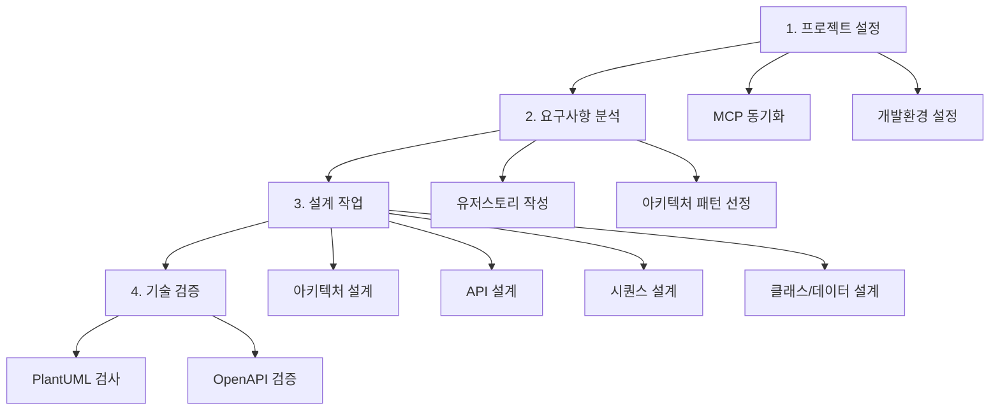

# 여행 일정 생성 서비스 설계 가이드

> 마이크로서비스 아키텍처 기반 여행 상세 일정 생성 서비스의 체계적인 설계 가이드

## 🚀 전체 워크플로우

## 📂 가이드 구조

### 🚀 1. 실행 프롬프트 (prompt/)
| 파일 | 설명 | 사용 시점 |
|------|------|-----------|
| [userstory-prompt.md](prompt/userstory-prompt.md) | 유저스토리 작성 실행 프롬프트 | 요구사항 분석 실행 시 |
| [design-prompt.md](prompt/design-prompt.md) | 전체 설계 실행 프롬프트 모음 | 각 설계 단계 실행 시 |

### 🔧 2. 설정 (setup/)
| 파일 | 설명 | 사용 시점 |
|------|------|-----------|
| *(향후 추가)* | MCP 서버 동기화 가이드 | 프로젝트 초기 설정 |
| *(향후 추가)* | 개발환경 설정 가이드 | 프로젝트 초기 설정 |

### 📝 3. 요구사항 분석 (requirements/)
| 파일 | 설명 | 사용 시점 |
|------|------|-----------|
| [userstory.md](requirements/userstory.md) | 유저스토리 작성 가이드 | 프로젝트 요구사항 정의 시 |
| [architecture-patterns.md](requirements/architecture-patterns.md) | 아키텍처 패턴 선정 가이드 | 시스템 아키텍처 설계 전 |

### 🏗️ 4. 설계 작업 (design/)
| 파일 | 설명 | 사용 시점 |
|------|------|-----------|
| [common-principles.md](design/common-principles.md) | 공통 설계 원칙 및 전략 | 모든 설계 단계에서 참조 |
| [architecture.md](design/architecture.md) | 논리/물리 아키텍처 설계 | 전체 시스템 구조 설계 시 |
| [api-design.md](design/api-design.md) | OpenAPI 기반 API 설계 | 서비스별 API 명세 작성 시 |
| [sequence-design.md](design/sequence-design.md) | 외부/내부 시퀀스 설계 | 서비스 플로우 설계 시 |
| [class-data-design.md](design/class-data-design.md) | 클래스/데이터 설계 | 세부 구현 설계 시 |

### 🛠️ 5. 기술 도구 (tools/)
| 파일 | 설명 | 사용 시점 |
|------|------|-----------|
| [plantuml-guide.md](tools/plantuml-guide.md) | PlantUML 문법 검사 가이드 | 다이어그램 작성 시 |
| [openapi-tools.md](tools/openapi-tools.md) | OpenAPI to CSV 변환 도구 | API 명세 CSV 변환 시 |
| openapi-to-csv/ | OpenAPI to CSV 변환기 | API 설계서 생성 시 |

## 🎯 빠른 참조

### 📋 상황별 가이드 선택

| 상황 | 실행 프롬프트 | 참조 가이드 |
|------|---------------|-------------|
| 🆕 새 프로젝트 시작 | - | setup/ (향후 추가 예정) |
| 📝 기능 요구사항 정의 | [prompt/userstory-prompt.md](prompt/userstory-prompt.md) | [requirements/userstory.md](requirements/userstory.md) |
| 🎨 UI/UX 설계 | [prompt/design-prompt.md](prompt/design-prompt.md) (UI/UX 섹션) | - |
| 🏗️ 시스템 아키텍처 선택 | [prompt/design-prompt.md](prompt/design-prompt.md) (패턴 섹션) | [requirements/architecture-patterns.md](requirements/architecture-patterns.md) |
| 🏛️ 논리 아키텍처 설계 | [prompt/design-prompt.md](prompt/design-prompt.md) (논리 섹션) | [design/architecture.md](design/architecture.md) |
| 🔌 API 명세 작성 | [prompt/design-prompt.md](prompt/design-prompt.md) (API 섹션) | [design/api-design.md](design/api-design.md) |
| 🔄 업무 플로우 설계 | [prompt/design-prompt.md](prompt/design-prompt.md) (시퀀스 섹션) | [design/sequence-design.md](design/sequence-design.md) |
| 📊 클래스 구조 설계 | - | [design/class-data-design.md](design/class-data-design.md) |
| ⚡ 공통 설계 원칙 확인 | - | [design/common-principles.md](design/common-principles.md) |
| 🎨 PlantUML 오류 해결 | - | [tools/plantuml-guide.md](tools/plantuml-guide.md) |
| 📊 API 명세 CSV 변환 | - | [tools/openapi-tools.md](tools/openapi-tools.md) |

### ⚡ 핵심 원칙

1. **🚀 실행 우선**: 프롬프트로 바로 실행, 가이드로 원리 이해
2. **🔄 병렬 처리**: 서브 에이전트 활용으로 동시 작업
3. **🏗️ 마이크로서비스**: 서비스 독립성과 확장성 확보
4. **📝 문서화**: PlantUML + OpenAPI 기반 표준화
5. **✅ 검증 우선**: 각 단계마다 자동 검증 수행
6. **🚀 점진적 구현**: MVP → 확장 → 고도화 단계적 접근

## 🔗 주요 링크

- **프로젝트 개요**: [CLAUDE.md](../CLAUDE.md)
- **유저스토리**: [../design/userstory.md](../design/userstory.md)
- **설계 결과물**: [../design/backend/](../design/backend/)
- **참고자료**: [CNA Bootcamp Guide](https://cna-bootcamp.github.io/clauding-guide/)

---

💡 **Tip**: 각 가이드는 독립적으로 사용 가능합니다. 현재 작업 단계에 맞는 가이드만 참조하여 효율적으로 진행하세요!