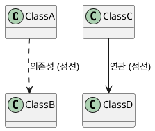

# PlantUML 문법 검사 가이드

## 목차
1. [개요](#개요)
2. [PlantUML 서버 설치](#plantuml-서버-설치)
3. [문법 검사 방법](#문법-검사-방법)
4. [화살표 문법 규칙](#화살표-문법-규칙)
5. [자동화 스크립트](#자동화-스크립트)
6. [문제 해결 (FAQ)](#문제-해결-faq)
7. [일괄 검사 방법](#일괄-검사-방법)

## 개요

PlantUML 다이어그램의 문법 오류를 사전에 검출하여 렌더링 실패를 방지하기 위한 가이드입니다. Docker 기반 PlantUML 서버를 활용하여 로컬에서 빠르게 문법을 검증할 수 있습니다.

## PlantUML 서버 설치

### Docker로 PlantUML 서버 실행

```bash
# PlantUML 서버가 실행 중인지 확인
docker ps | grep plantuml

# PlantUML 서버가 없으면 설치 및 실행
docker run -d --name plantuml -p 8080:8080 plantuml/plantuml-server:latest

# 서버 상태 확인
docker logs plantuml
```

### 서버 접속 확인

```bash
# 브라우저에서 확인
http://localhost:8080

# curl로 확인
curl -I http://localhost:8080
```

## 문법 검사 방법

### 방법 1: 파이프 방식 (권장) ⭐

가장 정확하고 빠른 방법으로, 파일 내용을 직접 파이프로 전달합니다.

```bash
# 기본 검사
cat diagram.puml | docker exec -i plantuml sh -c "java -jar /opt/plantuml.jar -pipe -tpng 2>&1 1>/dev/null"

# JAR 파일 위치가 다른 경우
JAR=$(docker exec plantuml find / -name "plantuml*.jar" 2>/dev/null | head -1)
cat diagram.puml | docker exec -i plantuml sh -c "java -jar $JAR -pipe -tpng 2>&1 1>/dev/null"
```

**장점:**
- 파일 복사 불필요
- 정확한 에러 라인 표시
- Windows 경로 문제 없음

### 방법 2: 파일 복사 방식

```bash
# 1. 고유 파일명 생성 (충돌 방지)
TEMP_FILE="/tmp/puml_$(date +%s)_$$.puml"

# 2. 파일 복사
docker cp diagram.puml plantuml:${TEMP_FILE}

# 3. JAR 파일 위치 찾기
JAR_PATH=$(docker exec plantuml find / -name "plantuml*.jar" 2>/dev/null | head -1)

# 4. 문법 검사
docker exec plantuml java -jar ${JAR_PATH} -checkonly ${TEMP_FILE}

# 5. 상세 에러 확인 (필요시)
docker exec plantuml sh -c "cd /tmp && java -jar ${JAR_PATH} -failfast -v ${TEMP_FILE} 2>&1 | grep -E 'Error line'"

# 6. 임시 파일 삭제
docker exec plantuml rm ${TEMP_FILE}
```

### 검사 결과 해석

| 출력 | 의미 | 대응 방법 |
|------|------|-----------|
| 출력 없음 | 문법 오류 없음 ✅ | 정상, 렌더링 가능 |
| "Some diagram description contains errors" | 오류 존재 ❌ | 파이프 방식으로 상세 확인 |
| "ERROR" + 라인 번호 | 특정 라인 오류 ❌ | 해당 라인 수정 |
| "Error line X in file" | X번째 줄 오류 ❌ | 해당 라인 문법 확인 |

## 화살표 문법 규칙

### 시퀀스 다이어그램 올바른 화살표 사용법

```plantuml
@startuml
' 올바른 사용법 ✅
A -> B: 동기 메시지 (실선)
A ->> B: 비동기 메시지 (실선, 열린 화살촉)
A -->> B: 비동기 응답 (점선, 열린 화살촉)  
A --> B: 점선 화살표 (일반)
A <-- B: 응답 (점선)
A ->x B: 실패/거부 (X 표시)
A ->>o B: 비동기 열린 원

' 잘못된 사용법 ❌
A ..> B: ' 오류! sequence diagram에서 유효하지 않음
@enduml
```

### 클래스 다이어그램 화살표



### 화살표 문법 주의사항

1. **`..>`는 sequence diagram에서 사용 금지**
2. 비동기 메시지는 `->>` 또는 `-->>` 사용
3. 동기/비동기를 명확히 구분하여 일관되게 사용
4. 다이어그램 타입별로 유효한 화살표가 다름

## 자동화 스크립트

### 완전한 문법 검사 스크립트

`check-plantuml.sh` 파일 생성:

```bash
#!/bin/bash
# check-plantuml.sh - PlantUML 문법 검사 스크립트

FILE=$1

if [ -z "$FILE" ]; then
    echo "사용법: $0 <plantuml-file>"
    exit 1
fi

if [ ! -f "$FILE" ]; then
    echo "❌ 파일을 찾을 수 없습니다: $FILE"
    exit 1
fi

echo "🔍 PlantUML 문법 검사 시작: $FILE"

# 1. 화살표 문법 사전 검사
echo "1️⃣ 화살표 문법 검사..."
if grep -q '\.\.>' "$FILE"; then
    echo "❌ 잘못된 화살표 발견: ..> (sequence diagram에서 사용 불가)"
    echo "   파일: $FILE"
    echo "   라인:"
    grep -n '\.\.>' "$FILE"
    echo ""
    echo "   💡 해결 방법:"
    echo "   - 비동기 메시지: ..> → ->>"
    echo "   - 점선 화살표: ..> → -->"
    exit 1
fi
echo "✅ 화살표 문법 통과"

# 2. Docker 서버 확인
echo "2️⃣ PlantUML 서버 확인..."
if ! docker ps | grep -q plantuml; then
    echo "❌ PlantUML 서버가 실행되고 있지 않습니다."
    echo "   다음 명령어로 서버를 시작하세요:"
    echo "   docker run -d --name plantuml -p 8080:8080 plantuml/plantuml-server:latest"
    exit 1
fi
echo "✅ 서버 실행 중"

# 3. PlantUML JAR 위치 찾기
echo "3️⃣ PlantUML JAR 찾기..."
JAR=$(docker exec plantuml find / -name "plantuml*.jar" 2>/dev/null | head -1)
if [ -z "$JAR" ]; then
    echo "❌ PlantUML JAR 파일을 찾을 수 없습니다."
    exit 1
fi
echo "✅ JAR 위치: $JAR"

# 4. PlantUML 엔진 검사 (파이프 방식)
echo "4️⃣ PlantUML 엔진 검사..."
ERROR=$(cat "$FILE" | docker exec -i plantuml sh -c "java -jar '$JAR' -pipe -tpng 2>&1 1>/dev/null")

if [ -z "$ERROR" ]; then
    echo "✅ 문법 검사 통과!"
    echo ""
    echo "🎉 모든 검사를 통과했습니다. 다이어그램을 렌더링할 수 있습니다."
else
    echo "❌ 문법 오류 발견:"
    echo "$ERROR"
    echo ""
    echo "💡 디버깅 팁:"
    echo "1. 에러 라인 번호를 확인하세요"
    echo "2. 괄호나 따옴표가 제대로 닫혔는지 확인하세요"
    echo "3. PlantUML 키워드 철자를 확인하세요"
    exit 1
fi
```

### Windows PowerShell 버전

`Check-PlantUML.ps1` 파일 생성:

```powershell
param(
    [Parameter(Mandatory=$true)]
    [string]$FilePath
)

# 파일 존재 확인
if (-not (Test-Path $FilePath)) {
    Write-Host "❌ 파일을 찾을 수 없습니다: $FilePath" -ForegroundColor Red
    exit 1
}

Write-Host "🔍 PlantUML 문법 검사 시작: $FilePath" -ForegroundColor Cyan

# 1. 화살표 문법 검사
Write-Host "1️⃣ 화살표 문법 검사..." -ForegroundColor Yellow
if (Select-String -Path $FilePath -Pattern "\.\.>") {
    Write-Host "❌ 잘못된 화살표 발견: ..>" -ForegroundColor Red
    Select-String -Path $FilePath -Pattern "\.\.>" | ForEach-Object {
        Write-Host "   라인 $($_.LineNumber): $($_.Line)" -ForegroundColor Red
    }
    Write-Host "`n💡 해결: ..> → ->> (비동기) 또는 --> (점선)" -ForegroundColor Yellow
    exit 1
}
Write-Host "✅ 화살표 문법 통과" -ForegroundColor Green

# 2. Docker 서버 확인
Write-Host "2️⃣ PlantUML 서버 확인..." -ForegroundColor Yellow
$dockerPs = docker ps --format "table {{.Names}}" | Select-String "plantuml"
if (-not $dockerPs) {
    Write-Host "❌ PlantUML 서버가 실행되고 있지 않습니다." -ForegroundColor Red
    exit 1
}
Write-Host "✅ 서버 실행 중" -ForegroundColor Green

# 3. PlantUML 검사 (파이프 방식)
Write-Host "3️⃣ PlantUML 엔진 검사..." -ForegroundColor Yellow
$content = Get-Content $FilePath -Raw
$error = $content | docker exec -i plantuml sh -c "java -jar /opt/plantuml.jar -pipe -tpng 2>&1 1>/dev/null"

if ([string]::IsNullOrWhiteSpace($error)) {
    Write-Host "✅ 문법 검사 통과!" -ForegroundColor Green
    Write-Host "`n🎉 모든 검사를 통과했습니다." -ForegroundColor Cyan
} else {
    Write-Host "❌ 문법 오류:" -ForegroundColor Red
    Write-Host $error -ForegroundColor Red
    exit 1
}
```

### 사용 권한 설정

```bash
# Linux/macOS
chmod +x check-plantuml.sh

# 실행
./check-plantuml.sh diagram.puml
```

```powershell
# Windows PowerShell
Set-ExecutionPolicy -ExecutionPolicy RemoteSigned -Scope CurrentUser

# 실행
.\Check-PlantUML.ps1 -FilePath diagram.puml
```

## 문제 해결 (FAQ)

### Q1: Windows에서 "No such file or directory" 오류

**문제:** Windows 경로가 Docker 컨테이너에서 인식되지 않음

**해결:**
```bash
# 파이프 방식 사용 (권장)
cat diagram.puml | docker exec -i plantuml sh -c "java -jar /opt/plantuml.jar -pipe -tpng 2>&1 1>/dev/null"

# 또는 WSL 사용
wsl cat diagram.puml | docker exec -i plantuml sh -c "java -jar /opt/plantuml.jar -pipe -tpng 2>&1 1>/dev/null"
```

### Q2: JAR 파일을 찾을 수 없음

**문제:** PlantUML JAR 파일 위치가 이미지마다 다름

**해결:**
```bash
# JAR 파일 위치 찾기
docker exec plantuml find / -name "plantuml*.jar" 2>/dev/null

# 일반적인 위치들
# /opt/plantuml.jar
# /usr/local/bin/plantuml.jar
# /app/plantuml.jar
```

### Q3: 특정 다이어그램 타입에서만 오류

**문제:** 다이어그램 타입별로 유효한 문법이 다름

**해결:**
```plantuml
' 다이어그램 타입 명시
@startuml
!define SEQUENCE
' 또는
skinparam style strictuml
@enduml
```

### Q4: 한글 렌더링 문제

**문제:** 한글이 깨지거나 표시되지 않음

**해결:**
```bash
# 폰트가 포함된 PlantUML 이미지 사용
docker run -d --name plantuml -p 8080:8080 plantuml/plantuml-server:jetty

# 또는 폰트 설정 추가
@startuml
skinparam defaultFontName "Noto Sans CJK KR"
@enduml
```

## 일괄 검사 방법

### 디렉토리 내 모든 PlantUML 파일 검사

`check-all-plantuml.sh`:

```bash
#!/bin/bash
# 디렉토리 내 모든 .puml, .plantuml, .txt 파일 검사

DIRECTORY=${1:-.}
FAILED=0
PASSED=0

echo "🔍 PlantUML 일괄 검사 시작: $DIRECTORY"
echo "========================================="

# PlantUML 파일 찾기
find "$DIRECTORY" -type f \( -name "*.puml" -o -name "*.plantuml" -o -name "*.txt" \) | while read -r file; do
    # PlantUML 키워드가 있는 파일만 검사
    if grep -q "@startuml" "$file" 2>/dev/null; then
        echo -n "검사 중: $file ... "
        
        # 파이프 방식으로 검사
        ERROR=$(cat "$file" | docker exec -i plantuml sh -c "java -jar /opt/plantuml.jar -pipe -tpng 2>&1 1>/dev/null")
        
        if [ -z "$ERROR" ]; then
            echo "✅ 통과"
            ((PASSED++))
        else
            echo "❌ 실패"
            echo "  오류: $ERROR"
            ((FAILED++))
        fi
    fi
done

echo "========================================="
echo "📊 검사 결과:"
echo "  ✅ 통과: $PASSED"
echo "  ❌ 실패: $FAILED"
echo "  📋 전체: $((PASSED + FAILED))"

if [ $FAILED -gt 0 ]; then
    exit 1
fi
```

### GitHub Actions 통합

`.github/workflows/plantuml-check.yml`:

```yaml
name: PlantUML Syntax Check

on:
  push:
    paths:
      - '**.puml'
      - '**.plantuml'
      - 'design/**.txt'
  pull_request:
    paths:
      - '**.puml'
      - '**.plantuml'
      - 'design/**.txt'

jobs:
  check:
    runs-on: ubuntu-latest
    
    steps:
    - uses: actions/checkout@v3
    
    - name: Start PlantUML Server
      run: |
        docker run -d --name plantuml -p 8080:8080 plantuml/plantuml-server:latest
        sleep 5  # 서버 시작 대기
    
    - name: Check PlantUML Syntax
      run: |
        # 검사 스크립트 실행
        chmod +x check-all-plantuml.sh
        ./check-all-plantuml.sh design/
    
    - name: Upload Error Report
      if: failure()
      uses: actions/upload-artifact@v3
      with:
        name: plantuml-errors
        path: plantuml-errors.log
```

### VS Code 통합

`.vscode/tasks.json`:

```json
{
    "version": "2.0.0",
    "tasks": [
        {
            "label": "Check PlantUML Syntax",
            "type": "shell",
            "command": "./check-plantuml.sh",
            "args": ["${file}"],
            "group": {
                "kind": "test",
                "isDefault": true
            },
            "presentation": {
                "echo": true,
                "reveal": "always",
                "focus": false,
                "panel": "shared"
            },
            "problemMatcher": {
                "pattern": {
                    "regexp": "Error line (\\d+) in file",
                    "line": 1
                },
                "owner": "plantuml",
                "fileLocation": "absolute"
            }
        }
    ]
}
```

## 권장 사항

1. **커밋 전 검사**: Git pre-commit hook으로 자동 검사
2. **CI/CD 통합**: PR 시 자동 문법 검사
3. **에디터 통합**: 저장 시 자동 검사
4. **배치 검사**: 주기적으로 전체 다이어그램 검사

## 추가 리소스

- [PlantUML 공식 문서](https://plantuml.com/)
- [PlantUML 문법 가이드](https://plantuml.com/ko/guide)
- [Docker PlantUML Server](https://hub.docker.com/r/plantuml/plantuml-server)